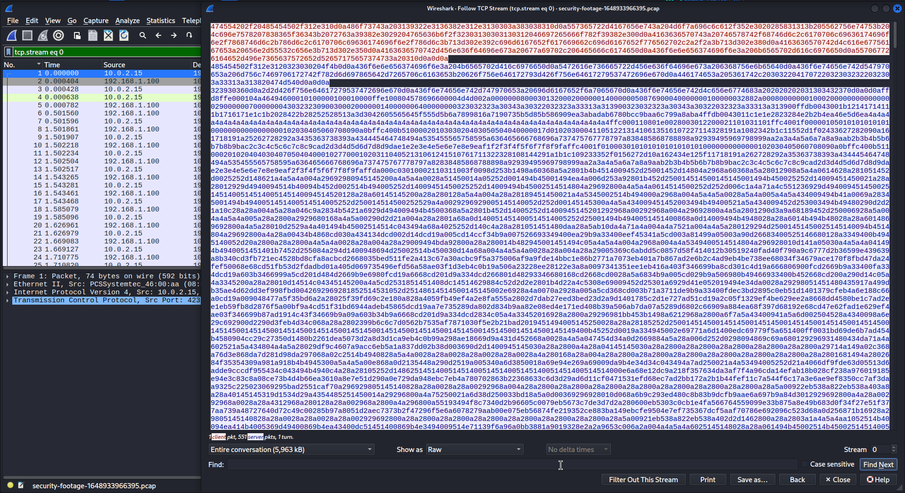
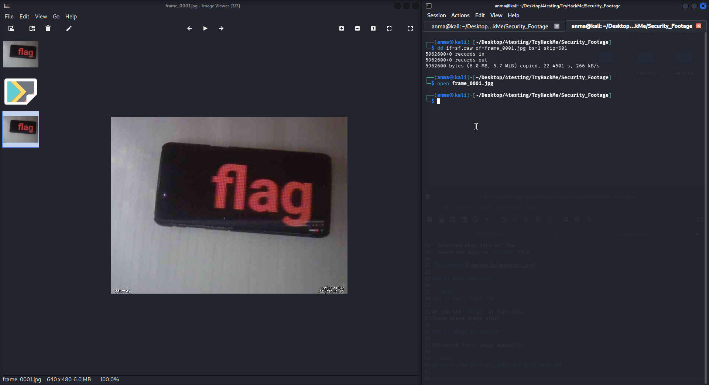
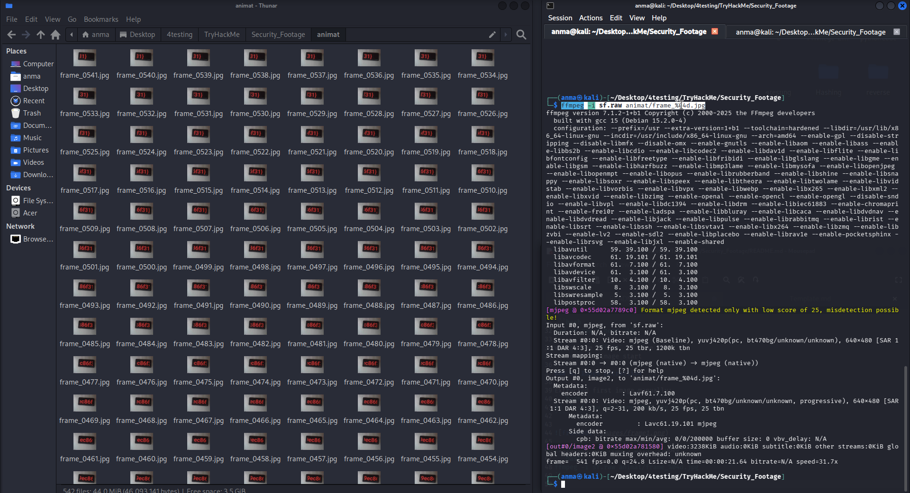
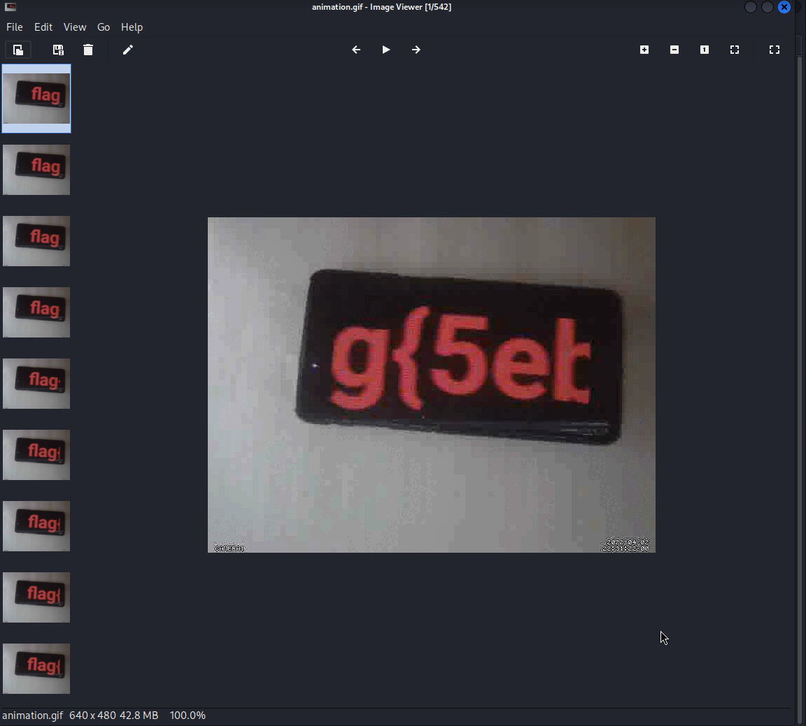

# Security Footage - TryHackMe Writeup

**Difficulty:** Medium    
**TL;DR:** Extract hidden flag from surveillance camera footage by analyzing PCAP file and converting MJPEG stream to animated GIF.
-------------------------

## Target
- Machine: `*.thm`
- Date: 2025-11-12
- Environment: TryHackMe / CTF

## Steps:

### 1. Initial Analysis:

- Downloaded the provided PCAP file
- Opened in Wireshark to analyze network traffic


### 2. TCP Stream Extraction

- Used Follow TCP Stream on the first request
- Selected Show data as: Raw
- Saved the data as `sf.raw` file



### 3. Data Analysis

```bash
xxd sf.raw | head -40
```
We can see `ff d8` at line 250 - this is where the JPEG image data starts.

### 4. Image Extraction

Extracted first image manually:
```bash
dd if=sf.raw of=frame_0001.jpg bs=1 skip=601
```



Extracted all frames using ffmpeg:
```bash
ffmpeg -i sf.raw animat/frame_%04d.jpg
```




Multiple Frames Discovery:
- Discovered 541 JPEG frames in the stream
- Each frame contained surveillance footage

### 5. GIF Creation

Converted all frames to animated GIF:
```bash
convert animat/frame_*.jpg animation.gif
```

### 6. Flag Discovery

Required watching the complete sequence to spot the flag in the animated footage.


